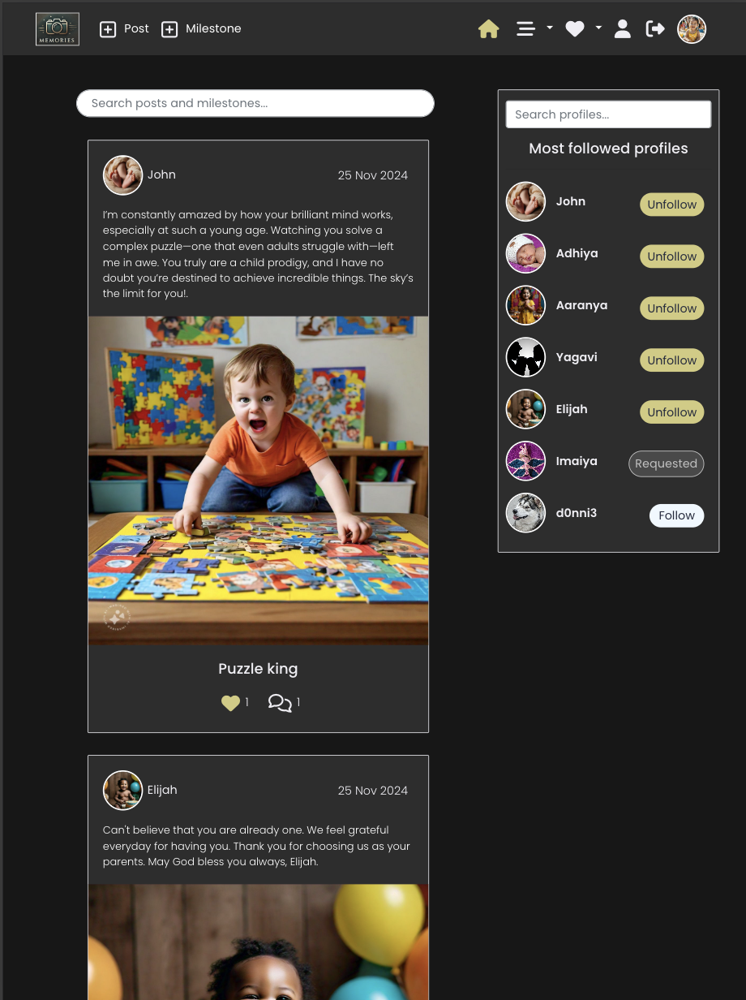

# Memories

- Link to the website: <a href="https://memories-frontend-895c7e867e2e.herokuapp.com" target="_blank" rel="noopener noreferrer">Memories</a>
- Link to TESTING.md of Memories: <a href="TESTING.md" target="_blank" rel="noopener noreferrer">Testing.md</a>
- Link to the backend API: <a href="https://memories-backend-16d0ed87a1d2.herokuapp.com" target="_blank" rel="noopener noreferrer">Memories-backend</a>
- Link to the backend repository: <a href="https://github.com/Yagavi1994/Memories-API" target="_blank" rel="noopener noreferrer">Memories-backend-repo</a>

# Project Overview

**Memories** is a specialized social media platform designed exclusively for parents to securely share and preserve their children's cherished moments. While many social media platforms allow parents to create profiles for their kids to share pictures and milestones, these platforms often expose such content to a wide and potentially unsafe audience. Recognizing the need for a safer, child-focused space, **Memories** was created.

This platform not only allows parents to upload and share their children's photos but also provides a dedicated space to document significant milestones, such as their first steps, first smiles, or first words. With **Memories**, parents can safeguard these precious moments in a secure and private environment, making it easy to revisit and cherish them in the future.

# Table of Content 

- [Project Overview](#project-overview)
- [Project objectives](#project-objectives)
- [User Experience](#user-experience) 
- [Design](#design)  
- [Agile Methodology](#agile-methodology)
- [Wireframes](#wireframes)
- [Features](#features)
- [Technologies Used](#technologies-used)
- [Testing](#testing)
- [Deployment](#deployment)
- [Credits](#credits)
- [Acknowledgement](#acknowledgement)

# Project Objectives

## Site Aims

- Develop a secure, vibrant, and user-friendly online platform for parents to share and cherish their children's memories exclusively.
- Connect seamlessly to the Memories-API back-end, ensuring smooth data management and user interactions.
- Offer parents an easy and intuitive way to register and log in to access the site's features.
- Provide members of the community with full CRUD (Create, Read, Update, Delete) functionality for both posts and milestones.
- Deliver a fully responsive and accessible site for users on desktop, tablet, and mobile devices.
- Allow registered users to safely share their children's photos in a protected environment designed exclusively for kids' content with privacy feature.
- Enable parents to document and save their children’s milestones, such as first steps, words, or smiles, to revisit and cherish in the future.
- Inspire and engage parents by allowing them to view and interact with posts and milestones shared by others.
- Enhance engagement by offering features like liking and commenting on posts or milestones shared by the community.
- Provide tools for users to filter content based on liked posts, followed users, or specific milestones.
- Integrate a search function for users to quickly find specific posts, milestones, or profiles.
- Empower users to personalize their profiles by adding and editing details about themselves and their children.

---

## Target Audiences

- Parents looking for a safe and private platform to share their children’s photos and milestones.
- Parents who want to document and preserve significant moments in their children’s lives in an organized and dedicated space.
- Parents concerned about the safety of sharing children’s photos on traditional social media platforms.
- Families who want to connect with a like-minded community of parents for inspiration and support.
- Parents interested in sharing and celebrating their parenting journey while engaging with other members of a close-knit community.

# User Experience

## User Stories

### Navigation & Authentication

#### Navigation: Navbar
#### User Story 1:  
**As a user**, I can view a navbar from every page so that I can navigate easily between pages.
- Navbar is visible on every page.
- Navbar includes links to all main pages (e.g., Home, Profile, Posts, Sign In, Sign Up).
- Navbar updates to show relevant options based on the logged-in status (e.g., "Sign In" and "Sign Up" for logged-out users; "Profile" and "Logout" for logged-in users).
- Navbar is responsive and adapts to various screen sizes.

---

#### Routing: Seamless Navigation
#### User Story 2:  
**As a user**, I can navigate through pages quickly so that I can view content seamlessly without page refresh.
- Users can navigate between pages without a full page reload (via client-side routing).
- Page transitions are smooth and quick, without any noticeable delays.
- Browser history is correctly updated to support back and forward navigation.

---

#### Authentication: Sign Up
#### User Story 3:  
**As a user**, I can create a new account so that I can access all the features for signed-up users.
- Users can access a sign-up form.
- Form validation ensures required fields are filled with appropriate formats (e.g., valid email).
- Error messages are shown for invalid input (e.g., duplicate email, weak password).
- Successful sign-up redirects users to a sign in page.
- Confirmation message is displayed upon successful account creation.

---

#### Authentication: Sign In
#### User Story 4:  
**As a user**, I can sign in to the app so that I can access functionality for logged-in users.
- Users can access a sign-in form.
- Form validation checks for required fields and provides error messages for invalid input.
- Users with valid credentials are redirected to the home or designated page.
- Error messages are displayed for incorrect credentials.

---

#### Authentication: Logged-in Status
#### User Story 5:  
**As a user**, I can tell if I am logged in or not so that I can log in if I need to.
- Logged-in status is visually indicated on all pages (e.g., with user avatar or "Logout" option).
- Logged-out status displays "Sign In" and "Sign Up" options instead.
- Users can easily distinguish between logged-in and logged-out states.

---

#### Authentication: Refreshing Access Tokens
#### User Story 6:  
**As a user**, I can maintain my logged-in status until I choose to log out so that my user experience is not compromised.
- Tokens automatically refresh before they expire, maintaining the user’s session.
- Users do not experience interruptions during normal use.
- Expired sessions redirect users to the login page with an appropriate message.
- Security measures ensure that tokens are only refreshed for authenticated sessions.

---

#### Navigation: Conditional Rendering
#### User Story 7:  
**As a logged-out user**, I can see sign-in and sign-up options so that I can sign in/sign up.
- Logged-out users see only "Sign In" and "Sign Up" options.
- Logged-in users see user-specific options (e.g., "Profile," "Logout").
- Navbar options dynamically update based on authentication status.

---

#### Avatar
#### User Story 8:  
**As a user**, I can view user avatars so that I can easily identify users of the application.
- User avatars are displayed wherever applicable (e.g., navbar, comments, posts).
- Default avatar is shown if a user has not set a custom avatar.
- User avatars are updated across the app if changed.

---

### Posts and Milestones

#### Create Posts
#### User Story 9:  
**As a logged-in user**, I can create posts so that I can share my images with the world.
- Only logged-in users can access the "Create Post" page.
- Users can add images and captions to their posts.
- Validation ensures all required fields are completed before submission.
- Upon successful post creation, users are redirected to the post or main feed.
- Users receive feedback or confirmation after successfully posting.

---

#### View a Post and Milestone
#### User Story 10:  
**As a user**, I can view the details of a single post and milestone so that I can learn more about it.
- Users can view details of a single post and milestone, including image, caption, likes, and comments.
- Post information is displayed in a clear and organized manner.
- Users can navigate back to the main feed easily.

---

#### Like a Post and Milestone
#### User Story 11:  
**As a logged-in user**, I can like a post or milestone so that I can show my support for the posts that interest me.
- Only logged-in users can like posts or milestones.
- Liked posts or milestones visually indicate the "liked" status.
- Like count updates in real-time without requiring a page refresh.
- Liked posts or milestones are saved in their respective liked posts and milestones page for future reference.

---

#### View Most Recent Posts and Milestones
#### User Story 12:  
 **As a user**, I can view all the most recent posts and milestones, ordered by most recently created first so that I am up to date with the newest content.  
- Posts and Milestones are displayed in order of most recent first.
- Users can scroll through a list of posts and milestones from the main feed.
- Each post and milestone displays key information (e.g., image, caption, like count).
---

#### Search for Posts or Milestones
#### User Story 13:  
**As a user**, I can search for posts and milestones with keywords so that I can find the posts, milestones and user profiles I am most interested in.  
- A search bar is accessible on the home, posts and milestones page.
- Users can enter keywords to find relevant posts, milestones or profiles.
- Search results display in real-time or after submission.

---

#### View Liked Posts or Milestones
#### User Story 14:  
**As a logged-in user**, I can view the posts and milestones I liked so that I can find the posts I enjoy the most.
- Logged-in users can access a list of posts and milestones they’ve liked.
- Liked posts or milestones display in order of most recently liked.
- Users can navigate to each liked post and milestone directly from the list.

---

#### View Posts or Milestones of Followed Users
#### User Story 15:  
**As a logged-in user**, I can view content filtered by users I follow so that I can keep up to date with what they are posting about.
- Logged-in users can view posts and milestones filtered by the users they follow.
- Posts and milestones are displayed in reverse chronological order.

---

#### Infinite Scroll
#### User Story 16:  
**As a user**, I can keep scrolling through the images on the site, that are loaded for me automatically so that I don't have to click on "next page" etc.
- Posts are loaded automatically as users scroll down the page.
- Users can continue scrolling without clicking “Next Page” or similar navigation.
- Loading indicators are displayed when more content is being fetched.

---
### The Post and Milestone Page

#### View Post and Milestone Page  
#### User Story 17:  
**As a user**, I can view the post and milestone page so that I can read the comments about the post and milestone.  
- Users can view a post and milestone page with all details, including comments and likes.  
- Users can easily navigate back to the main feed.

---

#### Edit Post and Milestone 
#### User Story 18:  
**As a post or milestone owner**, I can edit my post and milestone title and description so that I can make corrections or update it after it was created.  
- Only the post or milestone owner can access the "Edit Post or Milestone" option.  
- Post or Milestone owners can modify the title and description of their posts and milestones.  
- Updated post and milestone information is saved and displayed upon submission.

---

### Comment

#### Create a Comment  
#### User Story 19:  
**As a logged-in user**, I can add comments to a post so that I can share my thoughts about the post.  
- Logged-in users can add comments to a post.  
- Form validation checks for required fields.  
- Comments appear immediately after submission.

---

#### Comment Date  
#### User Story 20:  
**As a user**, I can see how long ago a comment was made so that I know how old a comment is.  
- Each comment displays a relative timestamp (e.g., “2 hours ago”).  
- Timestamps update dynamically to reflect time since posted.

---

#### View Comments  
#### User Story 21:  
**As a user**, I can read comments on posts so that I can read what other users think about the posts.  
- Users can read all comments under a post in chronological order.  
- Comments section is easily accessible and visible on the post page.

---

#### Delete Comment  
#### User Story 22:  
**As an owner of a comment**, I can delete my comment so that I can control removal of my comment from the application.  
- Only comment owners can see the "Delete" option.  
- Confirmation prompt appears before a comment is deleted.  
- Deleted comments are removed instantly from the page.

---

#### Edit Comment  
#### User Story 23:  
**As an owner of a comment**, I can edit my comment so that I can fix or update my existing comment.  
- Only comment owners can see the "Edit" option.  
- Comment owners can modify their comments.  
- Updated comment appears immediately after submission.

---

### The Profile Page

#### View Profile Page  
#### User Story 24:  
**As a user**, I can view other users’ profiles so that I can see their posts and learn more about them.  
- Users can view other users’ profiles, including posts and bio.  
- Profiles display user information, post count, and other relevant details.

---

#### View Most Followed Profiles  
#### User Story 25:  
**As a user**, I can see a list of the most followed profiles so that I can see which profiles are popular.  
- Users can see a list of the most followed profiles on the app.  
- List displays in descending order based on the number of followers.

---

#### User Profile Stats  
#### User Story 26:  
**As a user**, I can view statistics about a specific user: bio, number of posts, follows, and users followed so that I can learn more about them.  
- Profile pages display user statistics (e.g., bio, number of posts, followers, following).  
- Stats are updated in real-time when changes occur.

---

#### Follow/Unfollow Users  
#### User Story 27:  
**As a logged-in user**, I can follow and unfollow other users so that I can see and remove posts by specific users in my posts feed.  
- Logged-in users can follow or unfollow other users.  
- Followed users’ posts appear in the follower’s feed.  
- Follower and following counts update immediately after action.

---

#### View All Posts by a Specific User  
#### User Story 28:  
**As a user**, I can view all the posts by a specific user so that I can catch up on their latest posts, or decide I want to follow them.  
- Users can view a list of all posts by a specific user on their profile.  
- Posts display in reverse chronological order.

---

#### Edit Profile  
#### User Story 29:  
**As a logged-in user**, I can edit my profile so that I can change my profile picture and bio.  
- Only the profile owner can edit their profile.  
- Users can change their profile picture and bio.  
- Profile updates are saved and displayed immediately.

---

#### Update Username and Password  
#### User Story 30:  
**As a logged-in user**, I can update my username and password so that I can change my display name and keep my profile secure.  
- Logged-in users can access a form to update their username and password.  
- Form validation ensures the new username is unique and the password is secure.  
- Users receive a confirmation message upon successful update.  
- User session is maintained, or the user is prompted to re-authenticate if necessary.

---

#### Profile Privacy  
#### User Story 31:  
**As a user**, I can set my profile to public or private so that I have control over who can view my posts and information.  
- Users can access a setting on their profile page to toggle between "Public" and "Private" profile modes.  
- When set to "Public," any user (logged in or logged out) can view the profile and its posts.  
- When set to "Private," only approved followers can view the profile and its posts; non-followers see a message indicating the profile is private.  
- A notification or confirmation message appears to confirm the change in profile visibility.  
- The setting change is saved immediately and persists across sessions.

---

#### Delete Profile  
#### User Story 32:  
**As a logged-in user**, I can delete my profile and user account.  
- Only the profile owner can delete their profile and user account.  
- A confirmation message should be displayed asking the user to confirm deletion or cancel it before deleting their profile and user account.

---

### Milestones

#### Add and Manage Milestones  
#### User Story 33:  
**As a user**, I can add milestones for my baby (e.g., first steps, first words) to their profile so that I can keep a record of important developmental moments.  
- Users can access a "Milestones" section from their profile to add, edit, and delete milestones.  
- Milestone entries allow for fields such as milestone title (e.g., "First Steps"), date, and an optional description.  
- Each milestone can include a photo or video to capture the moment.  
- Milestones are displayed in chronological order on a dedicated "Milestones" page, separate from the "Posts" page.  
- The "Milestones" page is accessible from the user’s profile, and visibility depends on the profile’s public/private setting.  
- Users receive feedback upon successfully adding, editing, or deleting a milestone.  

---

### Future Goals for Memories

#### 1. **Mobile Application**
- Develop a mobile app for iOS and Android to enhance accessibility and provide a seamless experience on the go.

#### 2. **Social Sharing Integration**
- Allow users to share specific posts or milestones directly to social media platforms like Instagram, Facebook, and WhatsApp (optional for private accounts).

#### 3. **Advanced Privacy Controls**
- Introduce granular privacy settings where users can control visibility for each post or milestone individually.

#### 4. **Notification System**
- Implement real-time notifications for:
  - New comments or likes on posts or milestones.
  - Follower requests for private profiles.
  - Updates from followed users.

#### 5. **Milestone Templates**
- Provide customizable templates for common milestones (e.g., "First Steps," "First Day of School") with design elements like icons and captions.

#### 6. **Data Export and Printing**
- Enable users to download all their posts and milestones as a digital scrapbook or printable document.

#### 7. **Community Groups**
- Create group functionalities where parents can join or create groups based on shared interests (e.g., age groups, hobbies, or parenting topics).

#### 8. **Search and Tagging Enhancements**
- Add tagging functionality for posts and milestones.
- Enable users to search using tags or filter content by categories like "Firsts," "School," or "Family Trips."

#### 9. **Content Moderation Tools**
- Implement AI-powered moderation to automatically detect and flag inappropriate content for admin review, ensuring a safe community.

#### 10. **Memories Timeline**
- Introduce a visually engaging timeline view where users can see posts and milestones chronologically, creating a digital memory board.

These goals aim to enhance functionality, improve user engagement, and solidify **Memories** as a trusted, feature-rich platform for preserving and sharing children’s memories.

---

# Design

## Design Choices

The design of **Memories** embraces a dark theme, carefully selected to make the colorful and vibrant photos of children stand out prominently against the backdrop. This choice not only enhances the visual appeal but also provides a soothing and comfortable viewing experience for users, especially during extended browsing sessions, compared to a traditional light theme.

---

## Color Scheme

The color palette for **Memories** is centered around creating a modern, dark aesthetic while ensuring accessibility and visual balance. The website prominently features four key colors: **black**, **dark grey**, **gold**, and **white**.

- **Black**: Used as the primary background color, providing a rich and dramatic base for the content.
- **Dark Grey**: Applied to content sections such as posts, profiles, and milestones, creating a subtle contrast against the black background.
- **Gold**: Selected for buttons, hover effects, and accents, adding a touch of elegance and drawing attention to interactive elements.
- **White**: Used for text and buttons to ensure clarity, readability, and a clean, polished appearance.

This thoughtfully chosen color scheme ensures that the platform remains visually engaging while highlighting the personal and meaningful content shared by users.

## Typography

The website uses a single font, **Poppins**, with font-weight 300 throughout to maintain consistency and simplicity in its design. **Poppins** was chosen for its modern and clean aesthetic, which complements the sleek and professional look of the platform. 

Its versatility ensures:
- **Readability**: Clear and easy-to-read text across all devices and screen sizes.
- **Consistency**: A unified appearance throughout the website, aligning with the platform’s design goals.
- **Modern Appeal**: A contemporary style that resonates with the target audience and enhances the overall user experience. 

Using a single font helps streamline the design, creating a cohesive and visually harmonious interface.
### Poppins

## Logo

## Logo

The logo for **Memories** was thoughtfully crafted to embody the essence of the platform—a safe and cherished space for preserving children's milestones and moments. The design features a sleek, minimalist camera symbol in **gold**, reflecting the idea of capturing memories. The dark background complements the platform’s overall theme, ensuring the logo stands out prominently.

The camera signifies the core functionality of the platform—sharing and preserving precious moments. The clean and elegant design not only represents the brand's modern aesthetic but also emphasizes its mission to provide parents with a secure and meaningful way to document their children's journeys.

# Agile Methodology

Agile methodology is a flexible and iterative approach to software development that emphasizes collaboration, adaptability, and customer feedback. It allows teams to respond to changing requirements and deliver valuable features incrementally. In this project, we follow Agile principles to enhance productivity and ensure successful project delivery.

- **User Stories and Github Issues**: I utilized Github issues to create detailed user stories for my project. Each user story included essential components such as story points and acceptance criteria. These user stories were tracked either on the Kanban board or within the issues themselves.
- **Kanban Board for Prioritization**: The Github Kanban board played a crucial role in managing my project. User stories were assigned to specific issues, allowing me to define clear goals and priorities.
- **Milestones**: I divided the project into three distinct phases, each with its own set of goals and deadlines. This structured approach allowed me to stay organized and focused, ensuring steady progress. By working phase by phase within the set deadlines, I was able to stay motivated and successfully complete the project on time.

#### Project Sections: My project was organized into the following sections:

- To-do: User stories awaiting implementation.
- In-progress: Ongoing work.
- Done: Completed tasks.

To review the Kanban board for the project, please click [HERE](https://github.com/users/Yagavi1994/projects/5)

# Wireframes

I drew inspiration for my project from the Moments Walkthrough website, using it as a foundational guide for the design and structure. Consequently, I adopted the visual framework of the Moments application for most of the pages in my project. However, I created custom wireframes for a few key pages where unique functionality or design elements were required to better suit the objectives of Memories. For the rest of the pages, I aligned them closely with the Moments application’s layout while adding my personal touches to ensure a cohesive and polished user experience.

### Mobile
#### Sign-in Page

#### Home Page

#### Post Page

#### Profile Page

### Desktop
#### Sign-in Page

#### Home Page

#### Profile Page

# Features

## Navbar

The **Memories** navbar is designed to be fully responsive, providing seamless navigation across desktop, tablet, and mobile devices. It combines functionality and aesthetics, ensuring an intuitive user experience regardless of the screen size.

### Key Features:

1. **Dynamic Navigation Options**:
   - Links to **Home**, **Feed**, **Liked**, **Requests**, **Profile**, and **Sign Out** are organized clearly on the right.
   - Dropdown menus for **Feed** and **Liked** provide easy access to **Posts** and **Milestones**, allowing users to filter and explore content effortlessly.

2. **Action Buttons**:
   - Quick access to **Add Post** and **Add Milestone** links is prominently displayed on the left, enabling users to contribute new content with a single click.

3. **Logo Integration**:
   - The **Memories** logo is positioned on the left, doubling as a clickable link to the homepage for easy navigation.

4. **Responsiveness**:
   - **Desktop View**: Displays all options inline for maximum visibility and ease of access.
   - **Tablet View**: Adjusts the layout to accommodate medium-sized screens while maintaining full functionality.
   - **Mobile View**: Simplifies the design by consolidating navigation items into a responsive dropdown menu, optimizing the space for smaller screens.

5. **User Interaction**:
   - The profile picture is visible in the navbar, serving as a quick link to the user's profile page.
   - A **Requests** link allows private profile users to manage follow requests efficiently.

6. **Interactive Design**:
   - Buttons and links use **gold** highlights for hover effects, enhancing the interactive experience while maintaining the dark theme's elegance.

This responsive navbar ensures smooth and efficient navigation while preserving the platform's minimalist and user-centric design.

> - #### User Story 1:  
> - **As a user**, I can view a navbar from every page so that I can navigate easily between pages.
> - Navbar is visible on every page.
> - Navbar includes links to all main pages (e.g., Home, Profile, Posts, Sign In, Sign Up).
> - Navbar updates to show relevant options based on the logged-in status (e.g., "Sign In" and "Sign Up" for logged-out users; "Profile" and "Logout" for logged-in users).
> - Navbar is responsive and adapts to various screen sizes.

> - #### User Story 2:  
> - **As a user**, I can navigate through pages quickly so that I can view content seamlessly without page refresh.
> - Users can navigate between pages without a full page reload (via client-side routing).
> - Page transitions are smooth and quick, without any noticeable delays.
> - Browser history is correctly updated to support back and forward navigation.

#### Navbar Mobile

#### Navbar Tablet

#### Navbar Desktop

---

## Home Page

The **Home Page** serves as the central hub of the **Memories** platform, offering a clean and user-friendly interface for users to browse posts, discover milestones, and engage with the community.

### Key Features:

1. **Search Functionality**:
   - A **universal search bar** is prominently displayed at the top of the page, allowing users to search for specific posts and milestones with ease.
   - Another dedicated **profile search bar** is available in the sidebar to quickly find user profiles.

2. **Posts and Milestones Feed**:
   - Displays posts and milestones from followed users, ordered by the most recent first.
   - Each post and milestone includes:
     - **User avatar and name** for easy identification.
     - **Timestamp** to show when the post was created.
     - **Caption** or milestone description for context.
     - **Interactive options**: Users can like or comment directly from the feed.

3. **Posts and Milestones Integration**:
   - Posts and milestones are seamlessly integrated into the feed, allowing users to view and celebrate important memories alongside regular posts.

4. **Most Followed Profiles**:
   - The sidebar highlights the **most followed profiles**, providing users with suggestions to connect with popular community members.
   - Includes **follow/unfollow** buttons for quick interaction, encouraging users to expand their network.

5. **Responsive Design**:
   - The layout adapts gracefully across devices, ensuring optimal viewing and navigation on desktops, tablets, and mobile devices.

6. **Visual Content Focus**:
   - A dark theme enhances the visibility of vibrant and colorful pictures, making posts stand out.
   - The streamlined layout ensures that user-generated content remains the primary focus.

> - **User Story 12**:  
  > - **As a user**, I can view all the most recent posts and milestones, ordered by most recently created first so that I am up to date with the newest content.  
  > - Posts and Milestones are displayed in order of most recent first.
  > - Users can scroll through a list of posts and milestones from the main feed.
  > - Each post and milestone displays key information (e.g., image, caption, like count).

> - **User Story 13**:  
  > - **As a user**, I can search for posts and milestones with keywords so that I can find the posts, milestones and user profiles I am most interested in.  
  > - A search bar is accessible on the home, posts and milestones page.
  > - Users can enter keywords to find relevant posts, milestones or profiles.
  > - Search results display in real-time or after submission.

> - **User Story 25**:  
  > - **As a user**, I can see a list of the most followed profiles so that I can see which profiles are popular.  
  > - Users can see a list of the most followed profiles on the app.
  > - List displays in descending order based on the number of followers.

The **Home Page** provides users with an engaging and efficient way to explore content, connect with others, and celebrate shared memories.

---

### Posts and Milestones Page

The **Posts** and **Milestones** pages share a design similar to the **Home Page**, offering a clean and consistent layout. However, these pages are distinct in their content organization:

- The **Home Page** combines both posts and milestones into a unified feed.
- The **Posts** and **Milestones** pages, accessible through the **Feed** dropdown in the navbar, separate the content into their respective categories for focused browsing.

### Key Features:

1. **Dedicated Pages**:
   - The **Posts Page** displays only user-generated posts, such as photos or captions, allowing users to exclusively explore shared moments.
   - The **Milestones Page** showcases developmental milestones, providing users with an organized view of special achievements.

2. **Consistent Layout**:
   - Both pages follow the same visual and functional design as the home page, maintaining familiarity for seamless navigation.
   - Each item includes the user avatar, name, timestamp, description, and interaction options (likes and comments).

3. **Focused Browsing**:
   - Users can browse posts and milestones separately, making it easier to find specific content types.

4. **Interactive Features**:
   - Just like on the home page, users can like and comment directly on posts or milestones, encouraging engagement.

5. **Search and Filtering**:
   - Search bars on both pages allow users to find specific posts or milestones efficiently.

By offering separate pages for **Posts** and **Milestones**, the platform provides users with a focused and streamlined experience, enabling them to interact with the content they care about most.

> - **User Story 12**:  
  > - **As a user**, I can view all the most recent posts and milestones, ordered by most recently created first so that I am up to date with the newest content.  
  > - Posts and Milestones are displayed in order of most recent first.
  > - Users can scroll through a list of posts and milestones from the main feed.
  > - Each post and milestone displays key information (e.g., image, caption, like count).

> - **User Story 13**:  
  > - **As a user**, I can search for posts and milestones with keywords so that I can find the posts, milestones and user profiles I am most interested in.  
  > - A search bar is accessible on the home, posts and milestones page.
  > - Users can enter keywords to find relevant posts, milestones or profiles.
  > - Search results display in real-time or after submission.

#### Posts Page

#### Milestones Page

---

### Liked Page

The **Liked Page** mirrors the structure of the **Feed**, offering users an organized way to view their liked content. However, this page exclusively displays posts and milestones that the user has marked as "liked," providing a personalized space to revisit their favorite memories.

### Key Features:

1. **Separated Content**:
   - The **Liked Posts Page** displays all the posts the user has liked.
   - The **Liked Milestones Page** showcases all the milestones the user has liked.
   - Both are accessible via the **Liked** dropdown menu in the navbar, allowing users to switch between posts and milestones effortlessly.

2. **Familiar Layout**:
   - The design and functionality remain consistent with the **Feed**, ensuring a seamless browsing experience.
   - Each item includes:
     - **User avatar** and name.
     - **Timestamp** of when the post or milestone was created.
     - **Description or caption** of the liked item.
     - Options to interact further, such as commenting.

3. **Focused Browsing**:
   - Users can easily access and revisit the content they’ve liked without sifting through the main feed.

4. **Interactive Features**:
   - Users can engage further by commenting on liked posts or milestones directly from this page.

5. **Search Functionality**:
   - A search bar enables users to find specific liked posts or milestones by keywords, making it easy to locate particular content.

The **Liked Page** enhances user engagement by providing a convenient way to revisit their favorite memories, creating a personalized and enjoyable experience on the platform.

> - **User Story 14**:  
  > - **As a logged-in user**, I can view the posts I liked so that I can find the posts I enjoy the most.  
  > - Logged-in users can access a list of posts or milestones they’ve liked.
  > - Content displays in reverse chronological order, with the most recently liked items appearing first.

---

### Requests Page

The **Requests Page** is a dedicated section where users with private profiles can manage follow requests. When a user sets their profile to private, others who wish to follow them must send a follow request. These requests are displayed on the **Requests Page**, allowing the user to accept or decline them, ensuring full control over their privacy and connections.

### Key Features:

1. **Follow Request Management**:
   - Displays a list of pending follow requests.
   - Each request includes:
     - **Requester’s avatar** for easy identification.
     - **Requester’s name** displayed clearly.
     - Options to **accept** or **decline** the request.

2. **User Control**:
   - Private profile users can control who gains access to their posts and milestones by approving or rejecting follow requests.

3. **Interactive Design**:
   - Accepting a request immediately grants the requester access to the user’s private profile.
   - Declining a request removes it from the list and denies the requester access.

4. **Real-Time Updates**:
   - The page updates dynamically as requests are managed, ensuring an up-to-date list.

5. **Seamless Navigation**:
   - The **Requests Page** is easily accessible via the **Requests** link in the navbar, offering a streamlined user experience.

The **Requests Page** enhances user privacy and security, ensuring that private profile users have complete control over their audience and interactions.

> - **User Story 34**:  
  > - **As a user**, I can view follow requests and accept or decline them so that I have control over who follows me.  
  > - The **Requests Page** displays follow requests with the requester's avatar and name.  
  > - Users can accept or decline requests directly from the page.  
  > - Accepted requests grant the requester access to the user's private profile.

---

### Profile Page

The **Profile Page** provides users with a personalized space to showcase their posts, milestones, and profile information. It is designed to be visually engaging and intuitive, offering a clear overview of the user’s activity and connections.

### Key Features:

1. **User Information**:
   - Displays the user’s **profile picture**, **name**, and **bio** at the top of the page.
   - Highlights key statistics, including the number of:
     - **Posts**: Total posts shared by the user.
     - **Milestones**: Significant moments documented.
     - **Followers**: Users who follow the profile.
     - **Following**: Profiles the user is following.

2. **Tabbed Content**:
   - The page includes two tabs for easy navigation:
     - **Posts Tab**: Displays all the posts created by the user.
     - **Milestones Tab**: Displays all milestones shared by the user.
   - Each tab allows users to view the content in reverse chronological order.

3. **Interactive Features**:
   - Posts and milestones on the profile page have like and comment options, encouraging interaction with the content.
   - Allows users to showcase their memories and connect with their followers.

4. **Search Profiles**:
   - A **profile search bar** in the sidebar helps users find and explore other profiles quickly.
   - The **Most Followed Profiles** section highlights popular profiles with options to **follow/unfollow** or manage requests for private profiles.

5. **Responsive Design**:
   - The profile page layout adjusts seamlessly to desktop, tablet, and mobile views, ensuring an optimal user experience across all devices.

The **Profile Page** is an essential feature that combines personal expression, community engagement, and intuitive navigation, providing users with a platform to share and celebrate their cherished memories.

> - **User Story 24**:  
  > - **As a user**, I can view other users’ profiles so that I can see their posts and learn more about them.  
  > - Users can view other users’ profiles, including posts, milestones, and bio.  
  > - Profiles display user statistics, including post count, milestones, followers, and following.  

> - **User Story 28**:  
  > - **As a user**, I can view all the posts by a specific user so that I can catch up on their latest posts or decide I want to follow them.  
  > - Users can view a list of all posts by a specific user on their profile.  
  > - Posts display in reverse chronological order.  

---

### Private Profile Page

The **Private Profile Page** ensures that users have control over their content and audience by offering a secure and customizable space for private interactions.

### Key Features:

1. **Private Profile Indicator**:
   - Displays a **"This Profile is Private"** message to users who are not approved followers of the profile.
   - Ensures that posts, milestones, and other user details remain hidden from unauthorized viewers.

2. **Follow Request Button**:
   - Non-followers see a **"Follow"** button to request access to the private profile.
   - Upon clicking, the button updates to show **"Requested"**, confirming that a follow request has been sent.

3. **Controlled Access**:
   - Only approved followers can view the posts and milestones of a private profile.
   - Unauthorized users are restricted from accessing any content within the profile.

4. **Notification System**:
   - Profile owners receive notifications for each follow request, which can be managed in the **Requests Page**.
   - Once a request is accepted, the user gains access to the private profile’s content.

5. **Dynamic Privacy Toggle**:
   - Profile owners can easily switch between **Public** and **Private** modes from the **Edit Privacy Settings** menu.
   - Changes are applied instantly and persist across sessions.

6. **Responsive Design**:
   - The page adapts to various devices, maintaining functionality and ease of navigation on desktops, tablets, and mobile devices.

> - **User Story 31**:  
  > - **As a user**, I can set my profile to public or private so that I have control over who can view my posts and information.  
  > - Users can access a setting on their profile page to toggle between "Public" and "Private" profile modes.  
  > - When set to "Public," any user can view the profile and its posts.  
  > - When set to "Private," only approved followers can view the profile and its posts.  
  > - A notification confirms the change in profile visibility.  
  > - The privacy setting persists across sessions.  

> - **User Story 8**:  
  > - **As a user**, I can view user avatars so that I can easily identify users of the application.  
  > - User avatars are displayed on private profiles, while other content remains hidden from unauthorized viewers.  
  > - Default avatars are shown if a user has not set a custom avatar.

---

### Add Post Page

The **Add Post Page** allows users to create and share their cherished memories with the community. This page provides an intuitive interface for uploading images and adding content, making it simple for users to contribute to the platform.

### Key Features:

1. **Image Upload**:
   - Users can upload an image by clicking or tapping on the upload area, which prominently displays a placeholder icon.
   - Uploaded images are previewed in the designated area for confirmation before submission.

2. **Content Input**:
   - A clean and minimalistic form is provided for users to add:
     - **Title**: A brief and descriptive heading for the post.
     - **Content**: Additional details or captions for the image, enabling users to add context to their memories.

3. **Action Buttons**:
   - **Create Button**: Submits the post to be displayed on the user’s profile and the platform’s feed.
   - **Cancel Button**: Allows users to discard their input and navigate back without saving changes.

4. **User-Friendly Design**:
   - A visually balanced layout with clear instructions ensures ease of use.
   - The dark theme of the page highlights the image and form fields, maintaining the website’s aesthetic consistency.

5. **Responsive Layout**:
   - The page is optimized for all devices, ensuring that users can add posts seamlessly from desktops, tablets, or mobile devices.

The **Add Post Page** empowers users to document and share their memories effortlessly, fostering a sense of connection and engagement within the community.

> - **User Story 9**:  
  > - **As a logged-in user**, I can create posts so that I can share my images with the world.  
  > - Only logged-in users can access the **Add Post Page**.  
  > - Users can add images and captions to their posts.  
  > - Validation ensures all required fields are completed before submission.  
  > - Users receive feedback or confirmation after successfully posting.  

---

### Add Milestone Page

The **Add Milestone Page** is designed to help users document and cherish important milestones in their child’s life. This page provides an organized and detailed interface for capturing significant moments with optional images and contextual information.

### Key Features:

1. **Image Upload**:
   - Allows users to upload an image representing the milestone.
   - Clickable upload area with a placeholder icon for user convenience.
   - Uploaded images are previewed before submission.

2. **Milestone Details**:
   - **Milestone Title**: A concise field to describe the milestone (e.g., "First Steps").
   - **Date Field**: A date picker for specifying the exact date the milestone occurred.
   - **Age Details**: 
     - Input fields for **years** and **months** to record the child’s age during the milestone.
   - **Physical Measurements**:
     - Fields to record the child’s **height** (in cm) and **weight** (in kg) during the milestone.

3. **Category Selection**:
   - Dropdown menu to categorize the milestone (e.g., Physical, Emotional, Cognitive, etc.).
   - Helps organize milestones into relevant categories for easy browsing.

4. **Description Field**:
   - Provides space for users to elaborate on the milestone, including details or stories behind the moment.

5. **Action Buttons**:
   - **Create Button**: Saves the milestone and displays it in the user’s profile and milestones page.
   - **Cancel Button**: Discards the input and navigates the user back to the previous page without saving.

6. **User-Friendly Layout**:
   - A clear and intuitive interface that makes it easy for users to fill in milestone details.
   - The dark-themed design enhances focus on the input fields and uploaded images.

7. **Responsive Design**:
   - Optimized for all devices, allowing users to add milestones seamlessly on desktop, tablet, or mobile.

The **Add Milestone Page** provides a structured and personalized way to document milestones, ensuring that users can preserve and cherish these moments for years to come.

> - **User Story 33**:  
  > - **As a user**, I can add milestones for my baby so that I can keep a record of important developmental moments.  
  > - Users can add images, titles, descriptions, and relevant details like age, height, and weight.  
  > - Milestones are categorized and saved to the user’s profile and milestones page.  
  > - Feedback is provided upon successful milestone creation.  

---

### Post and Milestone Page

The **Post and Milestone Page** is the central location where users can view detailed content of a specific post or milestone. It provides a dedicated space for engaging with posts or milestones, leaving comments, and interacting with content created by other users.

### Key Features:

1. **Post Details**:
   - Displays the full content of the selected post or milestone, including the image, title, and any additional details provided by the user.
   - The author’s avatar, name, and post date are prominently displayed at the top for easy identification.

2. **Interaction Options**:
   - **Like Button**: Allows users to show their appreciation for the post or milestone. The like count updates dynamically.
   - **Comment Section**: Provides users with a text box to leave comments on the post or milestone.
     - Comments display the commenter’s avatar and name.
     - New comments are added in real-time.

3. **Empty Comment Placeholder**:
   - If no comments are present, a friendly message is displayed: "No comments yet, be the first to comment!"

4. **User-Friendly Input**:
   - An intuitive comment input field for users, ensuring quick and easy engagement.
   - Clear feedback with a "Post" button to submit comments.

5. **Real-Time Updates**:
   - Likes and comments update dynamically without the need for a page reload, enhancing the overall user
experience and keeping interactions seamless.

> - **User Story 10**:  
>   - **As a user**, I can view the details of a single post or milestone so that I can learn more about it.  
>   - Users can view details of a single post or milestone, including image, caption, likes, and comments.  
>   - Post or Milestone information is displayed in a clear and organized manner.  
>   - Users can navigate back to the main feed easily. 

> - #### User Story 11:  
> - **As a logged-in user**, I can like a post or milestone so that I can show my support for the posts that interest me.
> - Only logged-in users can like posts or milestones.
> - Liked posts or milestones visually indicate the "liked" status.
> - Like count updates in real-time without requiring a page refresh.
> - Liked posts or milestones are saved in their respective liked posts and milestones page for future reference.

> - #### User Story 17:  
> - **As a user**, I can view the post and milestone page so that I can read the comments about the post and milestone.  
> - Users can view a post and milestone page with all details, including comments and likes.  
> - Users can easily navigate back to the main feed.

> - **User Story 19**:  
>   - **As a logged-in user**, I can add comments to a post or milestone so that I can share my thoughts about the it.  
>   - Logged-in users can add comments to a post or milestone.  
>   - Form validation checks for required fields.  
>   - Comments appear immediately after submission.  

> - **User Story 20**:  
>   - **As a user**, I can see how long ago a comment was made so that I know how old a comment is.  
>   - Each comment displays a relative timestamp (e.g., “2 hours ago”).  
>   - Timestamps update dynamically to reflect time since posted.  

> - **User Story 21**:  
>   - **As a user**, I can read comments on posts so that I can read what other users think about the posts.  
>   - Users can read all comments under a post in chronological order.  
>   - Comments section is easily accessible and visible on the post page.

#### Post Page

#### Milestone Page

---

### Edit and Delete Post or Milestone Feature

The **Edit and Delete Post or Milestone** feature provides users with the ability to manage their own content. This functionality is seamlessly integrated into each post and milestone, allowing users to update or remove their content directly from the platform.

#### Key Features:
- **Edit Post or Milestone**:  
  - Users can modify the title, description, or associated media of their posts or milestones by selecting the **Edit** option from the dropdown menu.
  - Changes are applied immediately upon saving and reflected in real-time on the platform.
  - Form validation ensures that required fields are filled out correctly during editing.
  
- **Delete Post or Milestone**:  
  - Users can permanently remove their posts or milestones by selecting the **Delete** option.

#### Usability:
- The dropdown menu is accessed via a three-dot icon located on the post or milestone.
- Only the content owner can see the options to edit or delete.

This feature ensures users have complete control over their shared memories while maintaining simplicity and ease of use.

> - **User Story 18**:  
>   - **As a post owner**, I can edit my post title and description so that I can make corrections or update my post after it was created.  
>   - Only the post owner can access the "Edit Post" option.  
>   - Post owners can modify the title and description of their posts.  
>   - Updated post information is saved and displayed upon submission.  

> - **User Story 33**:  
>   - **As a user**, I can edit and delete milestones for my baby so that I can update or remove any records as needed.  
>   - Only the milestone owner can access the **Edit** and **Delete** options for their milestones.  
>   - Changes or deletions are saved instantly, and feedback is provided upon action completion.

---

#### Edit or Delete Menu

#### Edit Post

#### Edit Milestone

---

### Comments

The **Comments** feature allows users to engage in discussions or share their thoughts on posts. Below the post, users can add comments by typing into the provided input field and clicking the **Post** button. Posted comments appear instantly, showing the username, time of posting (relative timestamp), and the content of the comment. 

Additional functionality includes:  
- **Edit** and **Delete Options**: Users can edit or delete their own comments using the menu next to their comment.  
- **Real-Time Updates**: Any modifications to comments, such as edits or deletions, are immediately reflected on the page without needing a refresh.  
- **Avatar Display**: User avatars are displayed alongside their comments for easy identification.  
- **Chronological Order**: Comments are displayed in chronological order, making it simple to follow the flow of conversation.  

This feature enhances interactivity and community engagement, fostering meaningful connections among users.

> - **User Story 19**:  
>   - **As a logged-in user**, I can add comments to a post so that I can share my thoughts about the post.  
>   - Logged-in users can add comments to a post.  
>   - Form validation checks for required fields.  
>   - Comments appear immediately after submission.  

> - **User Story 20**:  
>   - **As a user**, I can see how long ago a comment was made so that I know how old a comment is.  
>   - Each comment displays a relative timestamp (e.g., “2 hours ago”).  
>   - Timestamps update dynamically to reflect time since posted.  

> - **User Story 21**:  
>   - **As a user**, I can read comments on posts so that I can read what other users think about the posts.  
>   - Users can read all comments under a post in chronological order.  
>   - Comments section is easily accessible and visible on the post page.  

> - **User Story 22**:  
>   - **As the owner of a comment**, I can delete my comment so that I can control its removal from the application.  
>   - Only comment owners can see the **Delete** option.  
>   - Confirmation prompt appears before a comment is deleted.  
>   - Deleted comments are removed instantly from the page.  

> - **User Story 23**:  
>   - **As the owner of a comment**, I can edit my comment so that I can fix or update my existing comment.  
>   - Only comment owners can see the **Edit** option.  
>   - Comment owners can modify their comments.  
>   - Updated comments appear immediately after submission.  

---

### Like

The **Like Feature** enables users to interact with posts and milestones by expressing their appreciation. This feature provides a seamless way for users to engage with content and show their support for other users' memories.

#### Key Features:
- **Toggle Like**:  
  - Logged-in users can like or unlike posts and milestones with a single click.
  - A heart icon visually represents the like status:
    - **Filled heart**: Indicates the user has liked the post or milestone.
    - **Empty heart**: Indicates the user has not liked the content.

- **Real-Time Updates**:  
  - The like count updates dynamically without requiring a page refresh.
  - The UI reflects the changes instantly to enhance the user experience.

- **Engagement Tracking**:  
  - Users can see the number of likes on each post or milestone, fostering a sense of community and interaction.

- **Personalized Interaction**:  
  - The feature is restricted to logged-in users, ensuring genuine engagement within the platform.

This feature creates a social dynamic where users can connect with and appreciate the content shared by others, making the platform more engaging and interactive.

> - **User Story 11**:  
>   - **As a logged-in user**, I can like a post so that I can show my support for the posts that interest me.  
>   - Only logged-in users can like posts or milestones.  
>   - Users can toggle likes on and off.  
>   - Liked posts or milestones visually indicate the "liked" status.  
>   - Like count updates in real-time without requiring a page refresh.  

> - **User Story 14**:  
>   - **As a logged-in user**, I can view the posts I liked so that I can find the posts I enjoy the most.  
>   - Logged-in users can access a list of posts or milestones they’ve liked.  
>   - Content displays in reverse chronological order, with the most recently liked items appearing first.  

---

### Infinite Scroll Feature

The **Infinite Scroll Feature** enhances user experience by allowing continuous scrolling through posts and milestones without the need for manual pagination. This feature ensures that users can seamlessly browse content without interruptions, providing a smooth and engaging experience.

#### Key Features:
- **Automatic Loading**:  
  - Additional posts or milestones load automatically as the user scrolls to the bottom of the page.
  - Eliminates the need for "Next Page" or "Load More" buttons, making navigation intuitive.

- **Seamless Experience**:  
  - Content loads dynamically without refreshing the page, ensuring uninterrupted browsing.
  - Loading indicators briefly appear while fetching new data to inform the user.

- **Optimized Performance**:  
  - Content is fetched in chunks to optimize server requests and minimize latency.
  - Infinite scrolling is implemented efficiently to maintain smooth performance, even with a large volume of data.

- **Consistent Flow Across Pages**:  
  - Infinite scrolling is consistent across the home page, posts, and milestones pages, ensuring a uniform experience.

This feature aligns with the platform's goal of creating an enjoyable and user-friendly interface, encouraging users to spend more time exploring and engaging with the content.

> - **User Story 16**:  
>   - **As a user**, I can keep scrolling through the images on the site, that are loaded for me automatically so that I don't have to click on "next page," etc.  
>   - Posts and milestones are loaded automatically as users scroll down the page.  
>   - Users can continue scrolling without clicking “Next Page” or similar navigation.  
>   - Loading indicators are displayed when more content is being fetched.

---

### Edit Profile Menu

The **Edit Profile Menu** provides users with an intuitive and consolidated interface to manage their account settings and profile details. This menu offers quick access to essential account customization and privacy control features, enhancing user autonomy and security.

#### Key Features:
- **Edit Profile**:  
  - Users can update their profile information, such as their bio and profile picture, ensuring their profile reflects their current preferences.

- **Change Username**:  
  - Allows users to update their username, making it easier to personalize or maintain consistency across platforms.

- **Change Password**:  
  - Enhances security by enabling users to update their passwords. Users are guided through secure validation steps to ensure password strength.

- **Change Privacy**:  
  - Empowers users to toggle their profile's privacy status between public and private.  
  - Private profiles restrict access to approved followers, ensuring greater control over visibility.
  - The default privacy status is set to public when a profile is created.

- **Delete Profile**:  
  - Users can permanently delete their profile and associated data, with a confirmation step to prevent accidental deletions.

This menu is designed with user convenience and privacy in mind, giving users comprehensive control over their account from a single location.

> - **User Story 29**:  
>   - **As a logged-in user**, I can edit my profile so that I can change my profile picture and bio.  
>   - Only the profile owner can edit their profile.  
>   - Users can change their profile picture and bio.  
>   - Profile updates are saved and displayed immediately.  

> - **User Story 30**:  
>   - **As a logged-in user**, I can update my username and password so that I can change my display name and keep my profile secure.  
>   - Form validation ensures the new username is unique and the password is secure.  
>   - Users receive a confirmation message upon successful update.  

> - **User Story 31**:  
>   - **As a user**, I can set my profile to public or private so that I have control over who can view my posts and information.  
>   - Users can toggle between "Public" and "Private" profile modes.  
>   - Setting changes persist across sessions.  

> - **User Story 32**:  
>   - **As a logged-in user**, I can delete my profile and user account.  
>   - A confirmation message is displayed before deletion.  
>   - Only the profile owner can delete their account.  

---

### No Results Found Page

The **No Results Found** page ensures a user-friendly experience even when users encounter invalid or unavailable pages. It uses an expressive and relatable illustration, paired with a clear message, to inform users that the requested page does not exist. This design minimizes frustration and keeps the experience light-hearted and visually engaging.

#### Key Features:
- **Illustration**:  
  - A custom graphic of a crying baby with "No Results Found" text reinforces the theme of the platform and adds a touch of humor to the situation.

- **Error Message**:  
  - The message, "Sorry, the page you're looking for doesn't exist," directly communicates the issue in simple and polite language.

- **Navigation Options**:  
  - The persistent navigation bar at the top allows users to easily return to essential areas of the site, such as the Home page or Sign-In page, avoiding dead-end experiences.

- **Consistent Styling**:  
  - The page maintains the platform’s dark theme and color palette, ensuring visual consistency.

This feature enhances user experience by gracefully handling errors and maintaining the platform’s friendly, family-oriented vibe.

> - **User Story 2**:  
>   - **As a user**, I can navigate through pages quickly so that I can view content seamlessly without page refresh.  
>   - Error pages do not break navigation flow, and the navbar provides users with alternate navigation paths.

#### No Results Found

#### No Posts Found

---

### Follow/Unfollow Button Feature

The **Follow/Unfollow Button** feature enables users to effortlessly manage their connections with others on the platform. This feature is seamlessly integrated into user profiles and lists, ensuring users can interact with the community and control their social circle.

#### Functionality:
- **Follow Button**:  
   - Allows a logged-in user to follow another user, adding their posts and milestones to the follower's feed.
   - Upon clicking, the button dynamically updates to display "Requested" for private profiles or "Unfollow" for public profiles. Additionally, the "Following" count on your profile increases, while the "Followers" count on the profile you followed is also updated in real-time.
   
- **Unfollow Button**:  
   - Enables a user to unfollow someone they are currently following, removing their content from the feed.
   - Once clicked, the button reverts to "Follow," providing an intuitive toggle experience. Additionally, the "Following" count on your profile deccreases, while the "Followers" count on the profile you followed is also updated in real-time.

- **Requested State**:  
   - For private profiles, a "Requested" label appears after sending a follow request, ensuring clarity until the request is accepted or declined.

- **Real-Time Updates**:  
   - The button state dynamically updates without requiring a page refresh, providing a smooth user experience.

- **Privacy Control**:  
   - If a private profile declines a follow request, the button resets to "Follow," maintaining transparency for both parties.

This feature fosters a sense of community while giving users full control over their social interactions.

> - **User Story 27**:  
  > - **As a logged-in user**, I can follow and unfollow other users so that I can see and remove posts by specific users in my feed.  
  > - Logged-in users can toggle between following and unfollowing seamlessly.  
  > - Followers’ posts are automatically added to the feed in real time.  
  > - Follow/Unfollow actions immediately update the button's state for better clarity.

---

### Most Followed Profiles

The **Most Followed Profiles** feature provides users with a quick overview of the most popular accounts on the platform. This feature fosters community engagement by encouraging users to explore and follow other active members of the Memories community.  

#### Key Features:
- **Search Bar**:  
  - A responsive search bar allows users to look for profiles by name effortlessly.  
  - As users type, the list filters dynamically to show matching profiles.

- **Profile List**:  
  - Displays avatars and names of the most-followed users in descending order of their follower count.  
  - Includes an **Unfollow** button for profiles the user already follows and a **Requested** button for pending follow requests.

- **User Interactivity**:  
  - Logged-in users can manage their follow relationships directly from this section by clicking on the **Unfollow** or **Requested** buttons without navigating to individual profiles.  

- **Real-time Updates**:  
  - Changes to follow status (follow/unfollow) reflect immediately in the list, maintaining consistency and accuracy.

This feature enhances discoverability, strengthens the platform’s sense of community, and makes profile management seamless for users.

> - **User Story 25**:  
>   - **As a user**, I can see a list of the most-followed profiles so that I can discover popular accounts.  
>   - Users can access a dynamically updated list of the most-followed profiles.  
>   - Users can follow/unfollow directly from the list.

---

### Authentication Pages

#### Sign-Up Page
The **Sign-Up Page** provides a simple and intuitive interface for new users to register and create an account on **Memories**. The page includes fields for entering a **username**, **password**, and **confirmation password**. Upon successful submission, the user is registered and redirected to the homepage to start using the platform.

Key features:
- **Validation:** Ensures all required fields are completed and passwords match.
- **Feedback:** Displays error messages for invalid inputs like duplicate usernames or weak passwords.
- **Link to Sign-In:** Provides an option for users to navigate to the Sign-In page if they already have an account.

#### Sign-In Page
The **Sign-In Page** is designed for returning users to access their accounts. Users are prompted to enter their **username** and **password**, and successful authentication redirects them to the homepage.

Key features:
- **Validation:** Ensures fields are filled correctly and provides error messages for incorrect credentials.
- **Link to Sign-Up:** Offers easy navigation for new users who wish to create an account.

Both pages feature the Memories logo on the right, maintaining consistency and reinforcing brand identity.

> - **User Story 3**:  
  > - **As a user**, I can create a new account so that I can access all the features for signed-up users.  
  > - Users can access a sign-up form with appropriate validations.  
  > - Displays feedback for successful or failed account creation.  

> - **User Story 4**:  
  > - **As a user**, I can sign in to the app so that I can access functionality for logged-in users.  
  > - Provides a secure and seamless login process with error handling for invalid credentials.  

> - **User Story 5**:  
  > - **As a user**, I can tell if I am logged in or not so that I can log in if I need to.  
  > - Clear indication of logged-in status across the site.

---

# Technologies Used 

## Languages Used
* HTML
* CSS
* Javascript
* JSX
* React
* React Bootstrap

## Frameworks, libraries and programs used

- [Am I Responsive](https://ui.dev/amiresponsive) To ensure the project looked good on various devices.
- [React-BootStrap](https://react-bootstrap.netlify.app/) to provide key components such as the navbar, containers, media and cards.
- [Chrome Dev Tools](https://developer.chrome.com/docs/devtools/) as a constant tool for helping develop the site and its functionality.
- [Cloudinary](https://cloudinary.com) to handle static images and files as well as to offer the User a front end method of uploading images.
- CSS to provide custom styling in addition to Bootstrap.
- [Django](https://www.djangoproject.com/) as a Python framework to develop the back-end API.
- [Dj-rest-auth](https://dj-rest-auth.readthedocs.io/en/latest/) used to handle user authentication.
- [Lucid Chart](https://www.lucidchart.com/) to develop the logic for the project.
- [ElephantSQL](https://www.elephantsql.com/) to handle the PostgreSQL database.
- [Miro](https://miro.com/) to assist with the planning phase of the project by drawing wireframes.
- [Font Awesome](https://fontawesome.com/) to provide various icons for the site.
- [Google Fonts](https://fonts.google.com/) for the fonts used site-wide.
- [Gitpod](https://gitpod.io/) to use as workspace to load and push my code to Github.
- [GitHub](https://github.com/) to create the repository for the project.
- [Heroku](https://www.heroku.com/) to deploy the project.
- [Google Fonts](https://fonts.google.com/) for the typography on the website
- [ChatGPT](https://chatgpt.com/) to generate logo for the site.
- [Meta AI](https://www.meta.ai/) to generate images for the site.

# Testing
Find the full testing documented in [TESTING.md](TESTING.md)

# Deployment & local development

## Deployment

#### **Deployment to Heroku**

This project is hosted on [**_Heroku_**](https://www.heroku.com/). Below are the steps I took to deploy my project.

1. Create a Procfile in the root project directory and add the following code:
   - `web: serve -s build`
2. Save all project files, and use the following commands to add, commit and push the changes to the GitHub repository:
   - `git add .`
   - `git commit -m "Initial commit"`
   - `git push`
3. On the Heroku Dashboard, create a new app. The app name must be unique.
4. Set location as appropriate.
5. Connect your Heroku account to your Github Repository following these steps:
    - Click on the `Deploy` tab and choose `Github-Connect to Github`.
    - Enter the GitHub repository name and click on `Search`.
    - Choose the correct repository for your application and click on `Connect`.
6. You can then choose to deploy the project manually or automatically, automatic deployment will generate a new application every time you push a change to Github, whereas manual deployment requires you to push the `Deploy Branch` button whenever you want a change made.
7. Once you have chosen your deployment method and have clicked `Deploy Branch` your application will be built and you should now see the `View` button, click this to open your application.

### Forking

1. Go to [the project repository](https://github.com/Yagavi1994/memories).
2. In the right most top menu, click the "Fork" button.
3. There will now be a copy of the repository in your own GitHub account.

### Cloning the repo & Running the project locally

1. Go to the following repository on GitHub: <hhttps://github.com/Yagavi1994/memories>.
2. At the top right of the screen, click the 'Code' button, and then click 'HTTPs'.
3. Copy the link in this field.
4. Open Gitpod, creat new project folder, open the terminal.
5. On the terminal type "git clone", then paste the copied url and press 'Enter'.
6. The clone process should now begin.

# Credits

### Images

* Chat-GPT
   * [ChatGpt](https://chatgpt.com/) used to generate the logo for the website.

* Meta-AI
   * [Meta-AI](https://www.meta.ai/) used to generate images for the website.

# Acknowledgement

I would like to thank to following people who helped me along the way in completing this project:
* Code-Institute for Advanced front-end curriculum and "Moments" walkthrough project which helped me to lay the basic foundation for my project.
* My Code Institute mentor, Richard Wells, for his valuable advice and comprehensive guidance.
* My cousin Pradeep for helping me with solving few bugs I had in the project.
* My family and friends for giving me moral support and for taking time to test the final version of the project.