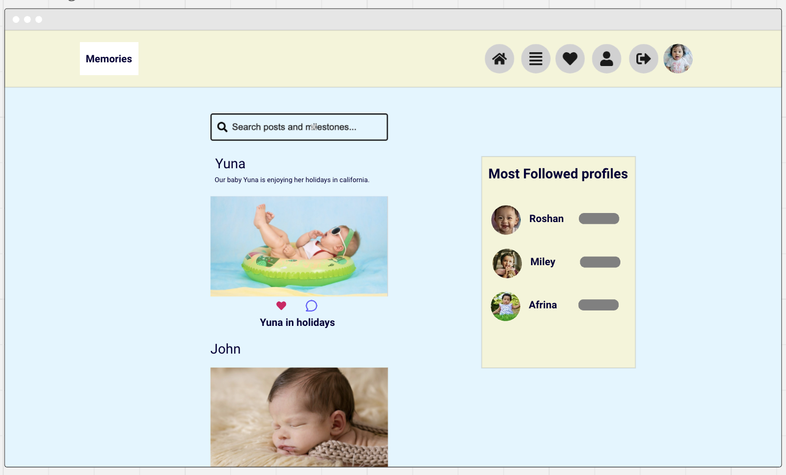

# Memories

Link to the website: [Memories](https://memories-frontend-895c7e867e2e.herokuapp.com)
Link to the backend API [Memories-backend](https://memories-backend-16d0ed87a1d2.herokuapp.com)
Link to the backend repository [Memories-backend-repo](https://github.com/Yagavi1994/Memories-API)

# Project Overview

**Memories** is a specialized social media platform designed exclusively for parents to securely share and preserve their children's cherished moments. While many social media platforms allow parents to create profiles for their kids to share pictures and milestones, these platforms often expose such content to a wide and potentially unsafe audience. Recognizing the need for a safer, child-focused space, **Memories** was created.

This platform not only allows parents to upload and share their children's photos but also provides a dedicated space to document significant milestones, such as their first steps, first smiles, or first words. With **Memories**, parents can safeguard these precious moments in a secure and private environment, making it easy to revisit and cherish them in the future.

# Table of Content 

- [Project Overview](#project-overview)
- [Project objectives](#project-objectives)
- [User Experience](#user-experience) 
- [Design](#design)  
- [Agile Methodology](#agile-methodology)
- [Database Scheme & User Journey](#database-scheme-&-user-journey)
- [Wireframes](#wireframes)
- [Features](#features)
- [Technologies Used](#technologies-used)
- [Testing](#testing)
- [Deployment & local development](#deployment-&-local-development)
- [Credits](#credits)
- [Acknowledgement](#acknowledgement)

# Project objectives

## Site Aims

- Develop a secure, vibrant, and user-friendly online platform for parents to share and cherish their children's memories exclusively.
- Connect seamlessly to the Memories-API back-end, ensuring smooth data management and user interactions.
- Offer parents an easy and intuitive way to register and log in to access the site's features.
- Provide members of the community with full CRUD (Create, Read, Update, Delete) functionality for both posts and milestones.
- Deliver a fully responsive and accessible site for users on desktop, tablet, and mobile devices.
- Allow registered users to safely share their children's photos in a protected environment designed exclusively for kids' content with privacy feature.
- Enable parents to document and save their children’s milestones, such as first steps, words, or smiles, to revisit and cherish in the future.
- Inspire and engage parents by allowing them to view and interact with posts and milestones shared by others.
- Enhance engagement by offering features like liking and commenting on posts or milestones shared by the community.
- Provide tools for users to filter content based on liked posts, followed users, or specific milestones.
- Integrate a search function for users to quickly find specific posts, milestones, or profiles.
- Empower users to personalize their profiles by adding and editing details about themselves and their children.

---

## Target Audiences

- Parents looking for a safe and private platform to share their children’s photos and milestones.
- Parents who want to document and preserve significant moments in their children’s lives in an organized and dedicated space.
- Parents concerned about the safety of sharing children’s photos on traditional social media platforms.
- Families who want to connect with a like-minded community of parents for inspiration and support.
- Parents interested in sharing and celebrating their parenting journey while engaging with other members of a close-knit community.

# User Experience

## User Stories

Here is the formatted list of all your user stories, following the markdown structure provided:

---

### Navigation & Authentication

#### Navigation: Navbar
#### User Story 1:  
**As a user**, I can view a navbar from every page so that I can navigate easily between pages.
- Navbar is visible on every page.
- Navbar includes links to all main pages (e.g., Home, Profile, Posts, Sign In, Sign Up).
- Navbar updates to show relevant options based on the logged-in status (e.g., "Sign In" and "Sign Up" for logged-out users; "Profile" and "Logout" for logged-in users).
- Navbar is responsive and adapts to various screen sizes.

---

#### Routing: Seamless Navigation
#### User Story 2:  
**As a user**, I can navigate through pages quickly so that I can view content seamlessly without page refresh.
- Users can navigate between pages without a full page reload (via client-side routing).
- Page transitions are smooth and quick, without any noticeable delays.
- Browser history is correctly updated to support back and forward navigation.

---

#### Authentication: Sign Up
#### User Story 3:  
**As a user**, I can create a new account so that I can access all the features for signed-up users.
- Users can access a sign-up form.
- Form validation ensures required fields are filled with appropriate formats (e.g., valid email).
- Error messages are shown for invalid input (e.g., duplicate email, weak password).
- Successful sign-up redirects users to a welcome or home page.
- Confirmation message is displayed upon successful account creation.

---

#### Authentication: Sign In
#### User Story 4:  
**As a user**, I can sign in to the app so that I can access functionality for logged-in users.
- Users can access a sign-in form.
- Form validation checks for required fields and provides error messages for invalid input.
- Users with valid credentials are redirected to the home or designated page.
- Error messages are displayed for incorrect credentials.

---

#### Authentication: Logged-in Status
#### User Story 5:  
**As a user**, I can tell if I am logged in or not so that I can log in if I need to.
- Logged-in status is visually indicated on all pages (e.g., with user avatar or "Logout" option).
- Logged-out status displays "Sign In" and "Sign Up" options instead.
- Users can easily distinguish between logged-in and logged-out states.

---

#### Authentication: Refreshing Access Tokens
#### User Story 6:  
**As a user**, I can maintain my logged-in status until I choose to log out so that my user experience is not compromised.
- Tokens automatically refresh before they expire, maintaining the user’s session.
- Users do not experience interruptions during normal use.
- Expired sessions redirect users to the login page with an appropriate message.
- Security measures ensure that tokens are only refreshed for authenticated sessions.

---

#### Navigation: Conditional Rendering
#### User Story 7:  
**As a logged-out user**, I can see sign-in and sign-up options so that I can sign in/sign up.
- Logged-out users see only "Sign In" and "Sign Up" options.
- Logged-in users see user-specific options (e.g., "Profile," "Logout").
- Navbar options dynamically update based on authentication status.

---

#### Avatar
#### User Story 8:  
**As a user**, I can view user avatars so that I can easily identify users of the application.
- User avatars are displayed wherever applicable (e.g., navbar, comments, posts).
- Default avatar is shown if a user has not set a custom avatar.
- User avatars are updated across the app if changed.

---

### Adding & Liking Posts

#### Create Posts
#### User Story 9:  
**As a logged-in user**, I can create posts so that I can share my images with the world.
- Only logged-in users can access the "Create Post" page.
- Users can add images and captions to their posts.
- Validation ensures all required fields are completed before submission.
- Upon successful post creation, users are redirected to the post or main feed.
- Users receive feedback or confirmation after successfully posting.

---

#### View a Post
#### User Story 10:  
**As a user**, I can view the details of a single post so that I can learn more about it.
- Users can view details of a single post, including image, caption, likes, and comments.
- Post information is displayed in a clear and organized manner.
- Users can navigate back to the main feed easily.

---

#### Like a Post
#### User Story 11:  
**As a logged-in user**, I can like a post so that I can show my support for the posts that interest me.
- Only logged-in users can like posts.
- Users can toggle likes on and off.
- Liked posts visually indicate the "liked" status.
- Like count updates in real-time without requiring a page refresh.

---

#### View Most Recent Posts
#### User Story 12:  
 **As a user**, I can view all the most recent posts and milestones, ordered by most recently created first so that I am up to date with the newest content.  
- Posts and Milestones are displayed in order of most recent first.
- Users can scroll through a list of posts and milestones from the main feed.
- Each post and milestone displays key information (e.g., image, caption, like count).
---

#### Search for Posts
#### User Story 13:  
**As a user**, I can search for posts and milestones with keywords so that I can find the posts, milestones and user profiles I am most interested in.  
- A search bar is accessible on the home, posts and milestones page.
- Users can enter keywords to find relevant posts, milestones or profiles.
- Search results display in real-time or after submission.

---

#### View Liked Posts
#### User Story 14:  
**As a logged-in user**, I can view the posts I liked so that I can find the posts I enjoy the most.
- Logged-in users can access a list of posts they’ve liked.
- Liked posts display in order of most recently liked.
- Users can navigate to each liked post directly from the list.

---

#### View Posts of Followed Users
#### User Story 15:  
**As a logged-in user**, I can view content filtered by users I follow so that I can keep up to date with what they are posting about.
- Logged-in users can view posts filtered by the users they follow.
- Posts are displayed in reverse chronological order.
- Users can toggle between “All Posts” and “Followed Users” views.

---

#### Infinite Scroll
#### User Story 16:  
**As a user**, I can keep scrolling through the images on the site, that are loaded for me automatically so that I don't have to click on "next page" etc.
- Posts are loaded automatically as users scroll down the page.
- Users can continue scrolling without clicking “Next Page” or similar navigation.
- Loading indicators are displayed when more content is being fetched.

---
### The Post Page

#### View Post Page  
#### User Story 17:  
**As a user**, I can view the post page so that I can read the comments about the post.  
- Users can view a post page with all details, including comments and likes.  
- Users can easily navigate back to the main feed.

---

#### Edit Post  
#### User Story 18:  
**As a post owner**, I can edit my post title and description so that I can make corrections or update my post after it was created.  
- Only the post owner can access the "Edit Post" option.  
- Post owners can modify the title and description of their posts.  
- Updated post information is saved and displayed upon submission.

---

#### Create a Comment  
#### User Story 19:  
**As a logged-in user**, I can add comments to a post so that I can share my thoughts about the post.  
- Logged-in users can add comments to a post.  
- Form validation checks for required fields.  
- Comments appear immediately after submission.

---

#### Comment Date  
#### User Story 20:  
**As a user**, I can see how long ago a comment was made so that I know how old a comment is.  
- Each comment displays a relative timestamp (e.g., “2 hours ago”).  
- Timestamps update dynamically to reflect time since posted.

---

#### View Comments  
#### User Story 21:  
**As a user**, I can read comments on posts so that I can read what other users think about the posts.  
- Users can read all comments under a post in chronological order.  
- Comments section is easily accessible and visible on the post page.

---

#### Delete Comment  
#### User Story 22:  
**As an owner of a comment**, I can delete my comment so that I can control removal of my comment from the application.  
- Only comment owners can see the "Delete" option.  
- Confirmation prompt appears before a comment is deleted.  
- Deleted comments are removed instantly from the page.

---

#### Edit Comment  
#### User Story 23:  
**As an owner of a comment**, I can edit my comment so that I can fix or update my existing comment.  
- Only comment owners can see the "Edit" option.  
- Comment owners can modify their comments.  
- Updated comment appears immediately after submission.

---

### The Profile Page

#### View Profile Page  
#### User Story 24:  
**As a user**, I can view other users’ profiles so that I can see their posts and learn more about them.  
- Users can view other users’ profiles, including posts and bio.  
- Profiles display user information, post count, and other relevant details.

---

#### View Most Followed Profiles  
#### User Story 25:  
**As a user**, I can see a list of the most followed profiles so that I can see which profiles are popular.  
- Users can see a list of the most followed profiles on the app.  
- List displays in descending order based on the number of followers.

---

#### User Profile Stats  
#### User Story 26:  
**As a user**, I can view statistics about a specific user: bio, number of posts, follows, and users followed so that I can learn more about them.  
- Profile pages display user statistics (e.g., bio, number of posts, followers, following).  
- Stats are updated in real-time when changes occur.

---

#### Follow/Unfollow Users  
#### User Story 27:  
**As a logged-in user**, I can follow and unfollow other users so that I can see and remove posts by specific users in my posts feed.  
- Logged-in users can follow or unfollow other users.  
- Followed users’ posts appear in the follower’s feed.  
- Follower and following counts update immediately after action.

---

#### View All Posts by a Specific User  
#### User Story 28:  
**As a user**, I can view all the posts by a specific user so that I can catch up on their latest posts, or decide I want to follow them.  
- Users can view a list of all posts by a specific user on their profile.  
- Posts display in reverse chronological order.

---

#### Edit Profile  
#### User Story 29:  
**As a logged-in user**, I can edit my profile so that I can change my profile picture and bio.  
- Only the profile owner can edit their profile.  
- Users can change their profile picture and bio.  
- Profile updates are saved and displayed immediately.

---

#### Update Username and Password  
#### User Story 30:  
**As a logged-in user**, I can update my username and password so that I can change my display name and keep my profile secure.  
- Logged-in users can access a form to update their username and password.  
- Form validation ensures the new username is unique and the password is secure.  
- Users receive a confirmation message upon successful update.  
- User session is maintained, or the user is prompted to re-authenticate if necessary.

---

#### Profile Privacy  
#### User Story 31:  
**As a user**, I can set my profile to public or private so that I have control over who can view my posts and information.  
- Users can access a setting on their profile page to toggle between "Public" and "Private" profile modes.  
- When set to "Public," any user (logged in or logged out) can view the profile and its posts.  
- When set to "Private," only approved followers can view the profile and its posts; non-followers see a message indicating the profile is private.  
- A notification or confirmation message appears to confirm the change in profile visibility.  
- The setting change is saved immediately and persists across sessions.

---

#### Delete Profile  
#### User Story 32:  
**As a logged-in user**, I can delete my profile and user account.  
- Only the profile owner can delete their profile and user account.  
- A confirmation message should be displayed asking the user to confirm deletion or cancel it before deleting their profile and user account.

---

### Milestones

#### Add and Manage Milestones  
#### User Story 33:  
**As a user**, I can add milestones for my baby (e.g., first steps, first words) to their profile so that I can keep a record of important developmental moments.  
- Users can access a "Milestones" section from their profile to add, edit, and delete milestones.  
- Milestone entries allow for fields such as milestone title (e.g., "First Steps"), date, and an optional description.  
- Each milestone can include a photo or video to capture the moment.  
- Milestones are displayed in chronological order on a dedicated "Milestones" page, separate from the "Posts" page.  
- The "Milestones" page is accessible from the user’s profile, and visibility depends on the profile’s public/private setting.  
- Users receive feedback upon successfully adding, editing, or deleting a milestone.  

---

### Admin Features

#### Admin Dashboard  
#### User Story 34:  
**As an admin**, I can access an admin dashboard from which I can manage all user-generated content and user-related data, so that I can maintain the platform's quality and ensure proper moderation.  
- Admin dashboard is accessible only to users with admin privileges.  
- Admin dashboard includes navigation links to manage:  
  - Profiles  
  - Users  
  - Posts  
  - Milestones  
  - Comments  
  - Likes  
  - Followers  
  - Follow Requests  
- Admin can view, create, edit, and delete:  
  - User profiles  
  - Posts  
  - Milestones  
  - Comments  
  - Likes  
- Admin can view a list of all users with key information (e.g., username, email, role, account status).  
- Admin can view all activity related to a specific user (posts, milestones, comments, likes, followers).

---

### Future Goals for Memories

#### 1. **Mobile Application**
- Develop a mobile app for iOS and Android to enhance accessibility and provide a seamless experience on the go.

#### 2. **Social Sharing Integration**
- Allow users to share specific posts or milestones directly to social media platforms like Instagram, Facebook, and WhatsApp (optional for private accounts).

#### 3. **Advanced Privacy Controls**
- Introduce granular privacy settings where users can control visibility for each post or milestone individually.

#### 4. **Notification System**
- Implement real-time notifications for:
  - New comments or likes on posts or milestones.
  - Follower requests for private profiles.
  - Updates from followed users.

#### 5. **Milestone Templates**
- Provide customizable templates for common milestones (e.g., "First Steps," "First Day of School") with design elements like icons and captions.

#### 6. **Data Export and Printing**
- Enable users to download all their posts and milestones as a digital scrapbook or printable document.

#### 7. **Community Groups**
- Create group functionalities where parents can join or create groups based on shared interests (e.g., age groups, hobbies, or parenting topics).

#### 8. **Search and Tagging Enhancements**
- Add tagging functionality for posts and milestones.
- Enable users to search using tags or filter content by categories like "Firsts," "School," or "Family Trips."

#### 9. **Content Moderation Tools**
- Implement AI-powered moderation to automatically detect and flag inappropriate content for admin review, ensuring a safe community.

#### 10. **Memories Timeline**
- Introduce a visually engaging timeline view where users can see posts and milestones chronologically, creating a digital memory board.

These goals aim to enhance functionality, improve user engagement, and solidify **Memories** as a trusted, feature-rich platform for preserving and sharing children’s memories.
---

# Design

## Design Choices

The design of **Memories** embraces a dark theme, carefully selected to make the colorful and vibrant photos of children stand out prominently against the backdrop. This choice not only enhances the visual appeal but also provides a soothing and comfortable viewing experience for users, especially during extended browsing sessions, compared to a traditional light theme.

---

## Color Scheme

The color palette for **Memories** is centered around creating a modern, dark aesthetic while ensuring accessibility and visual balance. The website prominently features four key colors: **black**, **dark grey**, **gold**, and **white**.

- **Black**: Used as the primary background color, providing a rich and dramatic base for the content.
- **Dark Grey**: Applied to content sections such as posts, profiles, and milestones, creating a subtle contrast against the black background.
- **Gold**: Selected for buttons, hover effects, and accents, adding a touch of elegance and drawing attention to interactive elements.
- **White**: Used for text and buttons to ensure clarity, readability, and a clean, polished appearance.

This thoughtfully chosen color scheme ensures that the platform remains visually engaging while highlighting the personal and meaningful content shared by users.

## Typography

The website uses a single font, **Poppins**, with font-weight 300 throughout to maintain consistency and simplicity in its design. **Poppins** was chosen for its modern and clean aesthetic, which complements the sleek and professional look of the platform. 

Its versatility ensures:
- **Readability**: Clear and easy-to-read text across all devices and screen sizes.
- **Consistency**: A unified appearance throughout the website, aligning with the platform’s design goals.
- **Modern Appeal**: A contemporary style that resonates with the target audience and enhances the overall user experience. 

Using a single font helps streamline the design, creating a cohesive and visually harmonious interface.
### Poppins

## Logo

## Logo

The logo for **Memories** was thoughtfully crafted to embody the essence of the platform—a safe and cherished space for preserving children's milestones and moments. The design features a sleek, minimalist camera symbol in **gold**, reflecting the idea of capturing memories. The dark background complements the platform’s overall theme, ensuring the logo stands out prominently.

The camera signifies the core functionality of the platform—sharing and preserving precious moments. The clean and elegant design not only represents the brand's modern aesthetic but also emphasizes its mission to provide parents with a secure and meaningful way to document their children's journeys.

# Agile Methodology

Agile methodology is a flexible and iterative approach to software development that emphasizes collaboration, adaptability, and customer feedback. It allows teams to respond to changing requirements and deliver valuable features incrementally. In this project, we follow Agile principles to enhance productivity and ensure successful project delivery.

- **User Stories and Github Issues**: I utilized Github issues to create detailed user stories for my project. Each user story included essential components such as story points and acceptance criteria. These user stories were tracked either on the Kanban board or within the issues themselves.
- **Kanban Board for Prioritization**: The Github Kanban board played a crucial role in managing my project. User stories were assigned to specific issues, allowing me to define clear goals and priorities.
- **Milestones**: I divided the project into three distinct phases, each with its own set of goals and deadlines. This structured approach allowed me to stay organized and focused, ensuring steady progress. By working phase by phase within the set deadlines, I was able to stay motivated and successfully complete the project on time.

#### Project Sections: My project was organized into the following sections:

- To-do: User stories awaiting implementation.
- In-progress: Ongoing work.
- Done: Completed tasks.

To review the Kanban board for the project, please click [HERE](https://github.com/users/Yagavi1994/projects/5)

# Database Scheme & User Journey

## Database Scheme 

This entity-relationship diagram shows a well-structured design for a Memories, allowing for efficient management of posts, milestones, comments, liked, followers and user profiles while ensuring smooth interaction between these entities.

# Wireframes
Since I took the moments walthrough website as my inspiration, I used it itself as a wireframe for my project. So I made wireframes only few of the important pages, others I used the same outlook of the moments web application.

### Mobile
#### Sign-in Page

#### Home Page

#### Post Page

#### Profile Page

### Desktop
#### Sign-in Page

#### Home Page

#### Profile Page
[Profile](readme/wireframe/profile-desktop.png)

# Features

## Navbar

The **Memories** navbar is designed to be fully responsive, providing seamless navigation across desktop, tablet, and mobile devices. It combines functionality and aesthetics, ensuring an intuitive user experience regardless of the screen size.

### Key Features:

1. **Dynamic Navigation Options**:
   - Links to **Home**, **Feed**, **Liked**, **Requests**, **Profile**, and **Sign Out** are organized clearly on the right.
   - Dropdown menus for **Feed** and **Liked** provide easy access to **Posts** and **Milestones**, allowing users to filter and explore content effortlessly.

2. **Action Buttons**:
   - Quick access to **Add Post** and **Add Milestone** links is prominently displayed on the left, enabling users to contribute new content with a single click.

3. **Logo Integration**:
   - The **Memories** logo is positioned on the left, doubling as a clickable link to the homepage for easy navigation.

4. **Responsiveness**:
   - **Desktop View**: Displays all options inline for maximum visibility and ease of access.
   - **Tablet View**: Adjusts the layout to accommodate medium-sized screens while maintaining full functionality.
   - **Mobile View**: Simplifies the design by consolidating navigation items into a responsive dropdown menu, optimizing the space for smaller screens.

5. **User Interaction**:
   - The profile picture is visible in the navbar, serving as a quick link to the user's profile page.
   - A **Requests** link allows private profile users to manage follow requests efficiently.

6. **Interactive Design**:
   - Buttons and links use **gold** highlights for hover effects, enhancing the interactive experience while maintaining the dark theme's elegance.

This responsive navbar ensures smooth and efficient navigation while preserving the platform's minimalist and user-centric design.

> - #### User Story 1:  
> - **As a user**, I can view a navbar from every page so that I can navigate easily between pages.
> - Navbar is visible on every page.
> - Navbar includes links to all main pages (e.g., Home, Profile, Posts, Sign In, Sign Up).
> - Navbar updates to show relevant options based on the logged-in status (e.g., "Sign In" and "Sign Up" for logged-out users; "Profile" and "Logout" for logged-in users).
> - Navbar is responsive and adapts to various screen sizes.

#### Navbar Mobile

#### Navbar Tablet

#### Navbar Desktop

---

## Home Page

The **Home Page** serves as the central hub of the **Memories** platform, offering a clean and user-friendly interface for users to browse posts, discover milestones, and engage with the community.

### Key Features:

1. **Search Functionality**:
   - A **universal search bar** is prominently displayed at the top of the page, allowing users to search for specific posts and milestones with ease.
   - Another dedicated **profile search bar** is available in the sidebar to quickly find user profiles.

2. **Posts and Milestones Feed**:
   - Displays posts and milestones from followed users, ordered by the most recent first.
   - Each post and milestone includes:
     - **User avatar and name** for easy identification.
     - **Timestamp** to show when the post was created.
     - **Caption** or milestone description for context.
     - **Interactive options**: Users can like or comment directly from the feed.

3. **Posts and Milestones Integration**:
   - Posts and milestones are seamlessly integrated into the feed, allowing users to view and celebrate important memories alongside regular posts.

4. **Most Followed Profiles**:
   - The sidebar highlights the **most followed profiles**, providing users with suggestions to connect with popular community members.
   - Includes **follow/unfollow** buttons for quick interaction, encouraging users to expand their network.

5. **Responsive Design**:
   - The layout adapts gracefully across devices, ensuring optimal viewing and navigation on desktops, tablets, and mobile devices.

6. **Visual Content Focus**:
   - A dark theme enhances the visibility of vibrant and colorful pictures, making posts stand out.
   - The streamlined layout ensures that user-generated content remains the primary focus.

> - **User Story 12**:  
  > - **As a user**, I can view all the most recent posts and milestones, ordered by most recently created first so that I am up to date with the newest content.  
  > - Posts and Milestones are displayed in order of most recent first.
  > - Users can scroll through a list of posts and milestones from the main feed.
  > - Each post and milestone displays key information (e.g., image, caption, like count).

> - **User Story 13**:  
  > - **As a user**, I can search for posts and milestones with keywords so that I can find the posts, milestones and user profiles I am most interested in.  
  > - A search bar is accessible on the home, posts and milestones page.
  > - Users can enter keywords to find relevant posts, milestones or profiles.
  > - Search results display in real-time or after submission.

> - **User Story 25**:  
  > - **As a user**, I can see a list of the most followed profiles so that I can see which profiles are popular.  
  > - Users can see a list of the most followed profiles on the app.
  > - List displays in descending order based on the number of followers.

The **Home Page** provides users with an engaging and efficient way to explore content, connect with others, and celebrate shared memories.

---

### About Page
The "About" page has a picture of the site owner and introduces the purpose and mission of the blog. It provides information on what the blog aims to achieve and the values behind it. This page is accessible from the main navigation bar.

- **User Story 8**: The "About" page should be well-organized, easy to read, and offer details about the blog's goals.

---

### Contact Page
The contact page allows visitors to reach out to the blog administrators for inquiries or support. It includes a contact form with fields for the user's name, email address, and message. Upon submission, users receive a confirmation message.

- **User Story 9**: Visitors should be able to submit inquiries through the contact page, and receive confirmation after submission.

---

### Blog Post Page
Each blog post has its own dedicated page, displaying the title, full content, source, and published date. Users can easily navigate between posts using "Next" and "Previous" buttons. The post page also includes options for sharing the content on social media.

- **User Story 2**: Blog posts should have dedicated pages with easy navigation options.

---

### Navigation Between Posts
The blog allows users to easily navigate between posts using "Next" and "Previous" buttons. These buttons are located at the bottom of each blog post, enabling visitors to move chronologically between posts without returning to the homepage or a category page. This seamless navigation enhances the user experience by allowing users to explore more content in a convenient manner.

- **User Story 3**: As a visitor, I want to navigate between posts using "Next" and "Previous" buttons so that I can explore more content.

---

### Add and Remove Favourites
Users can favourite blog posts for later reference. Each post has a "Like" or "Favourite" button that adds or removes the post from the user's favourites list. A success message appears after each action.

- **User Story 24**: Users should be able to like/favourite posts and see them listed in their profile's favourites section.

#### Add Favourites

#### Remove Favourites

---

### Add, Update and Delete Comments
Registered users can leave comments on blog posts, update their existing comments, or delete them. Each comment is displayed with the user's name, avatar, and the time it was posted. Comments can be edited or removed at any time.

- **User Story 23**: Users should be able to add, update, and delete their comments on blog posts.

---

### Filter Content by Category

The blog provides a feature that allows users to filter posts based on categories. This enables visitors to browse content specific to their interests, such as newborn care, toddler tips or feeding advice. The categories are accessible via a dropdown in the navigation bar, providing an easy way for users to discover posts related to particular topics.

- **User Story 4**: As a visitor, I want to filter blog posts by category so that I can browse specific topics relevant to my interests.

---

### Pagination for Blog Posts
The blog implements pagination for blog post listings when there are more than 5 posts on a single page. Pagination helps break up the content into smaller chunks, allowing for quicker loading times and a better user experience. The pagination controls are displayed at the bottom of the blog posts list, allowing users to navigate between pages of content easily.

- **User Story 10**: As a visitor, I want to navigate between multiple pages of blog posts when there are more than 5 posts per page so that I can easily browse through the content.

### Profile Page
Users have a dedicated profile page where they can view their personal information, including their avatar, name, email address, and a list of their favourite posts and comment history. The page also provides options to edit their details.

- **User Story 25**: Users should be able to view their profile and access their favourites and comments.

  
---

### Edit and Delete Picture Page
Users can update or delete their profile picture through the "Edit Picture" page. They can upload a new image from their system or choose from pre-defined avatars. If the picture is deleted, a default avatar will be applied.

- **User Story 26**: Users should be able to edit or delete their profile picture, with changes reflected in their profile.

#### Edit Picture

#### Delete Picture

---

### Favourites Page
The favourites page lists all posts the user has liked or favourited. Each post shows the title and excerpt. Users can quickly access posts they’ve saved.

- **User Story 27**: Users should have access to a list of their favourite posts via their profile page.

---

### Comments Page
The comments page provides a history of all the comments made by the user. It shows each comment, the date it was posted, and the blog post it was made on. Each comment is linked to the original comment in the blog post for easy navigation and when clicked it takes the user to that particular comment highlighting it.

- **User Story 28**: Users should be able to see their comment history in their profile.

---

### Delete Account
Users have the option to permanently delete their account. This action removes all user data, including posts, favourites, and comments. Users must confirm account deletion, and once deleted, they are logged out and redirected to the homepage.

- **User Story 29**: Users should be able to delete their account, which will permanently remove their data.

---

### Header
The header has a logo and  includes a navigation bar that allows users to access important sections of the blog, such as Home, About, Contact, Categories, Login, Register, Profile and Logout. It is present on every page and highlights the current page for easy navigation.

- **User Story 5**: The navigation bar should be present at the top of every page and include links to key sections of the site.

---

### Footer
The footer includes copyright information, social media links, and a "Back to Top" button for quick navigation. Social media links open the respective platforms in new tabs.

- **User Story 7**: The footer should provide copyright details, social media links, and a functional "Back to Top" button.

---

### Restricted Features Notification

Certain features of the blog, such as commenting on posts and adding posts to favourites, are reserved for registered users. When a visitor attempts to access these features without being logged in, the system displays a prompt informing them that they need to either log in or sign up to proceed. This ensures that user-specific actions are secured and associated with the correct user account.

The notification provides a clear and friendly message, with links to the login and registration pages. Until the visitor logs in or registers, they are prevented from using these restricted features.

- **User Story 13**: When attempting to use restricted features (e.g., commenting, favouriting), the system should notify the user to log in or sign up, and prevent access to these features until they are registered.

---

### Sign Up
Visitors can create an account through the registration form, which includes fields for email, username, and password. Validation ensures that all fields are properly formatted, and users must meet specific password requirements.

- **User Story 14**: Visitors should be able to sign up for an account, providing valid credentials to register.

---

### Email Verification
Upon successful registration, users receive an email verification link. The user must confirm their email before accessing certain features. The verification email contains a link that confirms the account when clicked.

- **User Story 20**: Users should receive an email verification link after registration, which they must confirm to activate their account.

---

### Log In
Registered users can log in using their email/username and password. After successful login, they are redirected to their profile or homepage.

- **User Story 15**: Users should be able to log in using their credentials and access their profile and blog features.

---

### Log Out
Users can securely log out of their accounts. Upon logging out, they are redirected to the homepage, and a confirmation message is displayed.

- **User Story 16**: Users should be able to log out from their account and secure their session.

---

### Forgot Password
If a user forgets their password, they can request a password reset link through the "Forgot Password" link on the login page. An email is sent with instructions to reset their password.

- **User Story 21**: Users should be able to request a password reset link via email.

---

### Reset Password
Upon receiving the reset email, users can click the link to access a secure page where they can set a new password. The new password must meet security requirements before the user can log in.

- **User Story 22**: Users should be able to reset their password via the link sent in their email.

---

### Responsiveness
The blog is fully responsive and works seamlessly across all devices, including desktops, tablets, and mobile phones. The layout, images, and interactive elements automatically adjust to fit the screen size, providing a consistent experience.

- **User Story 11**: The blog should be responsive across all devices, ensuring smooth navigation and readability.

---

### Displaying Messages for Successful and Unsuccessful Requests
The system displays confirmation messages for actions such as logging in, logging out, commenting, favouriting posts, and more. Similarly, error messages are shown for unsuccessful requests (e.g., login failures, form validation errors).

- **User Story 24, 26, 21, 16**: The system should show success messages after completing actions like favouriting posts, editing profiles, resetting passwords, and logging out.

---

### User Experience
The design of the blog focuses on ease of use and enhancing the user experience. The site incorporates smooth animations, vibrant colors, and an intuitive interface to keep users engaged. Key actions such as commenting, browsing posts, and navigating through the blog are designed to be seamless and efficient.

- **User Story 17**: The blog should include smooth animations and vibrant colors to enhance the overall user experience.

---

### 404 and 500 Error Pages

Cradle Blog includes custom error pages to ensure that users are provided with a clear and helpful message when something goes wrong while navigating the site.

#### 404 Error Page (Page Not Found)
When a user tries to access a page that doesn’t exist, they are redirected to a custom 404 error page. This page provides a friendly message, letting the user know that the page they are looking for cannot be found, along with helpful navigation options to return to the homepage or explore other sections of the site.

- **User Story 18**: As a visitor, I want to see a clear and helpful message when I try to access a page that doesn’t exist (404 error), so that I can understand the issue and navigate back to a useful part of the site.

---

#### 500 Error Page (Internal Server Error)
If something goes wrong on the server-side, users are presented with a custom 500 error page. This page informs the user that there was an internal error and that the site administrators are working to fix the issue. The 500 error page prevents the default technical error page from being shown and ensures the user experience is preserved even during technical failures.

- **User Story 19**: As a visitor, I want to see an informative message when there is an internal server error (500 error), so that I know the issue is being addressed and can still navigate to other parts of the site.

---

Both the 404 and 500 error pages help keep the user engaged and informed, even when errors occur, and provide a clear pathway to continue using the site.

### Admin Features

The blog includes an administrative dashboard that allows the admin to manage the blog’s content and user interactions effectively. The admin has full control over creating, editing, and deleting blog posts, as well as managing user comments and reviewing inquiries submitted through the contact form. Additionally, the admin can view and delete user accounts if necessary.

Key functionalities include:
- **Manage Blog Posts**: Admins can create new blog posts, edit existing ones, and delete posts that are no longer relevant. Each post can be assigned a category and status (e.g., draft, published).
- **Manage Comments**: Admins can approve or delete comments to ensure that discussions remain constructive and spam-free.
- **View Contact Inquiries**: Admins can view user-submitted contact forms, including the sender's name, email, and message.
- **Manage User Accounts**: Admins can view user profiles and delete accounts if needed, ensuring the integrity and safety of the platform.

This robust set of admin tools ensures that the blog is consistently maintained and operates smoothly.

- **User Story 28**: As an admin, I want to manage blog posts so that I can control the content that is published. Additionally, I want to manage comments, view contact inquiries, and delete user accounts as needed to maintain site integrity.

---

# Technologies Used 

## Languages Used
* HTML
* CSS
* Javascript
* Python

## Frameworks, libraries and programs used
- [GitHub](https://github.com/vero-nika-2828/yasmin-jas-photography) - To save and store files and code for the website in a secure location 
- [Gitpod](https://gitpod.io/workspaces) - A cloud based IDE used for version control, development of the code to build the website and to commit and push to GithHb
- [Heroku](https://dashboard.heroku.com/) - was used as the deployment platform for this project
 simplifying the design process
- [Am I Responsive](http://ami.responsivedesign.is/): was used to create the multi-device mock-up you can see at the start of this README.md file.
- [WC3 Validator](https://validator.w3.org/), [Jigsaw W3 Validator](https://jigsaw.w3.org/css-validator/), [JS validator](https://jshint.com/) and [PEP8](https://pep8ci.herokuapp.com/): were all used to validate the website.
- [os](https://docs.python.org/3/library/os.html): python built-in modules.
- [Bootstrap5](https://getbootstrap.com/docs/5.0/getting-started/introduction/): was used to create the front-end design.
- [Coloors](https://coolors.co/): was used to create the color scheme.
- [Cloudinary](https://cloudinary.com/): was used to host the static files and media.
- [Gunicorn](https://gunicorn.org/): as the server for Heroku.
- [Dj_database_url](https://pypi.org/project/dj-database-url/0.5.0/): to parse the database URL from the environment variables in Heroku.
- [Psycopg2](https://pypi.org/project/psycopg2/): as an adaptor for Python and PostgreSQL databases.
- [Allauth](https://allauth.org/): for authentication, registration, account management.
- [Crispy Forms & Crispy Bootstrap5](https://django-crispy-forms.readthedocs.io/en/latest/): to style the forms.
- [djrichtextfield](https://pypi.org/project/django-richtextfield/): for handling rich text content.
- [django resized](https://pypi.org/project/django-resized/): Resizes image origin to specified size and save it in 'WEBP' format.
- [dj-cloudinary-storage](https://pypi.org/project/django-cloudinary-storage/): to facilitates integration with Cloudinary.
- [Django](https://www.djangoproject.com/start/): as a main python framework for my project.
- [Jinja2 - templating language](https://jinja.palletsprojects.com/en/3.1.x/): was used to simplify dynamic content generation, enhance security, and promote code organization in project templates.
- [App.diagram-online](https://app.diagrams.net/): was used to create the database schema.
- [Microsoft Outlook - SMTP settings](https://support.microsoft.com/en-us/office/pop-imap-and-smtp-settings-for-outlook-com-d088b986-291d-42b8-9564-9c414e2aa040): was used to send email to user (scenario: forgot password).
- [Miro-online](https://miro.com/): was used to create the wireframe of the site.
- [Google Fonts](https://fonts.google.com/) - was used for the typography on the website
- [Font Awesome](https://fontawesome.com/) - was used for the iconography on the website
- Google Dev Tools - was used to troubleshoot and test features, solve issues with responsiveness and styling
- [ChatGPT](https://chatgpt.com/) - was used to generate images for blog post and compress the pictures and convert it to webp
- [Google Spreadsheet](https://docs.google.com/spreadsheets/) - was used to make the database scheme for the site.
- [Google Slides](https://docs.google.com/presentation/) - was used to draw database relationship entity diagram.
- [Google Drawio](https://app.diagrams.net/) - was used to draw Flowchart

# Testing
Find the full testing documented in [TESTING.md](TESTING.md)

# Deployment & local development

## Deployment

1. A new repository was created using 'Code-Instutute-Org/ci-full-template'.
2. A meaningful name was given to my new repository and I selected 'Create Repository'.
3. Inside the created repo select the 'Code' button above the file list on the right hand side.
4. Ensure HTTPS is selected and click the clipboard on the right of the URL to copy it.
5. Open Gitpod, creat new project folder, open the terminal, On the terminal type "git clone", then paste the copied url and press 'Enter'.
6. Version control was used throughout the project using the following commands in the terminal:
    - git add . **OR** git add "file name" - to stage the changes and get them ready for being committed to the local repo.
    - git commit -m "Description of the update" - to save the change and commit the change to the local repo
    - git push origin main - to push all committed changes to the GitHub repo.

### Forking

1. Go to [the project repository](https://github.com/Yagavi1994/Cradle).
2. In the right most top menu, click the "Fork" button.
3. There will now be a copy of the repository in your own GitHub account.

### Cloning the repo & Running the project locally

1. Go to the following repository on GitHub: <https://github.com/Yagavi1994/Cradle>.
2. At the top right of the screen, click the 'Code' button, and then click 'HTTPs'.
3. Copy the link in this field.
4. Open Gitpod, creat new project folder, open the terminal.
5. On the terminal type "git clone", then paste the copied url and press 'Enter'.
6. The clone process should now begin.

### Deploying with Heroku

I followed the below steps using the [Code Institute tutorial](https://docs.google.com/document/d/1CncA1F2JClME2S_K0w4XoV3edMjOl_HrOQoEs3h9LOo/edit#heading=h.hvy9tw74f1o0):

The following command in the IDE will create the relevant files needed for Heroku to install your project dependencies `pip3 freeze --local > requirements.txt`.

1. Go to [Heroku.com](https://dashboard.heroku.com/apps) and login, if you do not already have an account then you will need to create one.
2. Click the `New` dropdown and select `Create New App`.
3. Enter a name for your new project, all Heroku apps need to have a unique name, you will be prompted if you need to change it.
4. Select the region you are working in.

#### Heroku Settings  

You will need to set your Environment Variables - this is a key step to ensuring your application is deployed properly.

1. In the Settings tab, click on `Reveal Config Vars` and set the following variables:
   #### Add the following keys and corresponding values to it.
   
   
2. In your project:
    - Create a file `env.py` and put it into `.gitignore`.
    - Add the above keys and corresponding values mentioned in config vars in it, like DATABASE_URL, CLOUDINARY_URL and SECRET_KEY to `env.py`.
    - Comment out the original DATABASE settings from `settings.py` and add default Database code.
    - Run your migrations.

#### Heroku Deployment

In the Deploy tab:

1. Connect your Heroku account to your Github Repository following these steps:
    - Click on the `Deploy` tab and choose `Github-Connect to Github`.
    - Enter the GitHub repository name and click on `Search`.
    - Choose the correct repository for your application and click on `Connect`.
2. You can then choose to deploy the project manually or automatically, automatic deployment will generate a new application every time you push a change to Github, whereas manual deployment requires you to push the `Deploy Branch` button whenever you want a change made.
3. Once you have chosen your deployment method and have clicked `Deploy Branch` your application will be built and you should now see the `View` button, click this to open your application.
4. Be sure to set `DEBUG` to `False` in your `settings.py` before deploying.

# Credits

### Images

Images were taken from Adobe Stock and Pixabay

* Freepik
   * [Picture used for Banner](https://www.freepik.com/free-photo/top-view-childhood-cancer-awareness-month-background-concepttoys_29015039.htm#fromView=search&page=1&position=41&uuid=7918f628-075c-4250-8108-ceea74803937)

* Chat-GPT
   * [Pictures used in the Blog Post](https://chatgpt.com/)

* Meta-AI
   * [Picture used in the Logo](https://www.meta.ai/)

# Acknowledgement

I would like to thank to following people who helped me along the way in completing this project:
* Code-Institute for Full-stack development curriculum and "I Think Therefore I blog" walkthrough project which helped me to lay the basic foundation for my project.
* My Code Institute mentor, Martina Terlevic, for her valuable advice and comprehensive guidance.
* Tutors for helping me with solving few issues I had in the project.
* My family and friends for giving me moral support and for taking time to test the final version of the project.