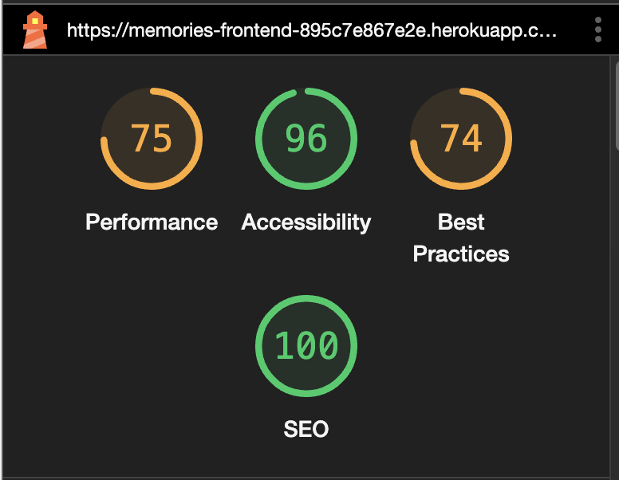
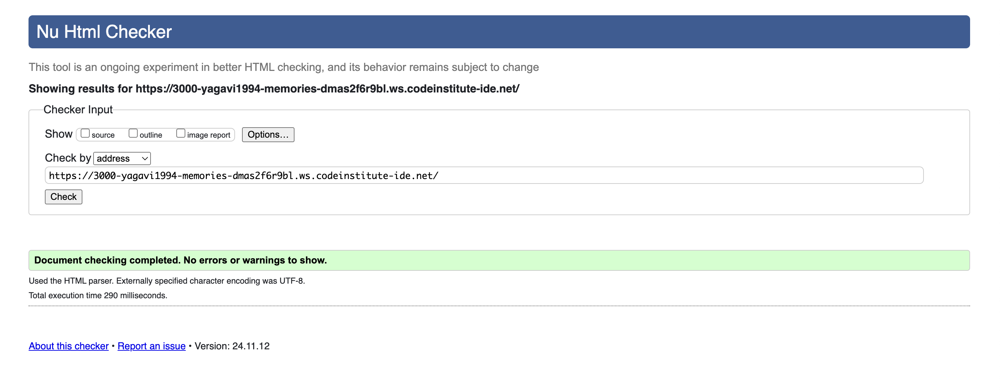

# TESTING

* [Lighthouse Testing](#lighthouse-testing)
* [Validator Testing](#validator-testing)
* [Responsiveness Testing](#responsiveness-testing)
* [C.R.U.D Testing](#crud-testing)
* [Manual Testing](#manual-testing)
* [Fixed Bugs](#fixed-bugs)
* [Unfixed Bug](#unfixed-bug)

### Lighthouse
Google Lighthouse in Chrome Developer Tools was used to test the application within the areas of _Performance_, _Accessibility_, _Best Practices_ and _SEO_. The testing showed the following result:

- Home Page - Performance: 75, Accessibility: 96, Best Practises: 74, SEO: 100




## Validator Testing

### HTML Validator [W3C](https://validator.w3.org/)

 No errors were found when the deployed URL was passed through W3C HTML validation checker.



### CSS Validator [W3C - Jigsaw CSS](https://jigsaw.w3.org/css-validator/)

No errors or warnings were found when the deployed URL was passed through the W3C CSS Validation checker.


## Responsiveness Testing

| **TEST**                      | **ACTION**              | **EXPECTATION**             | **RESULT** |
| ----------------------------- | ----------------------- | --------------------------- | ---------- |
| Sign Up page - responsiveness | Size site down to 320px | all elements stay on screen | ✅         |
| Sign Up page - responsiveness | Size site up to 1920px  | all elements stay on screen | ✅         |
| Email Verification Sent page - responsiveness | Size site down to 320px | all elements stay on screen | ✅         |
| Email Verification Sent page - responsiveness | Size site up to 1920px  | all elements stay on screen | ✅         |
| Login page - responsiveness    | Size site down to 320px | all elements stay on screen | ✅         |
| Login page - responsiveness    | Size site up to 1920px  | all elements stay on screen | ✅         |
| Forgot Password process (4-pages) - responsiveness | Size site down to 320px | all elements stay on screen | ✅         |
| Forgot Password process (4-pages) - responsiveness | Size site up to 1920px  | all elements stay on screen | ✅         |
| Nav Bar - responsiveness    | Size site down to 320px and the menu changes to burger icon below 768px | all elements stay on screen | ✅         |
| Nav Bar - responsiveness    | Size site up to 1920px and the burger icon changes to menu above 768px  | all elements stay on screen | ✅         |
| Sign in page - responsiveness    | Size site down to 320px | all elements stay on screen | ✅         |
| Sign in page - responsiveness    | Size site up to 1920px  | all elements stay on screen | ✅         |
| Sign up page - responsiveness    | Size site down to 320px | all elements stay on screen | ✅         |
| Sign up page - responsiveness    | Size site up to 1920px  | all elements stay on screen | ✅         |
| Home page - responsiveness    | Size site down to 320px | all elements stay on screen | ✅         |
| Home page - responsiveness    | Size site up to 1920px  | all elements stay on screen | ✅         |
| Posts Feed page- responsiveness    | Size site down to 320px | all elements stay on screen | ✅         |
| Posts Feed page - responsiveness    | Size site up to 1920px  | all elements stay on screen | ✅         |
| Milestones Feed page - responsiveness    | Size site down to 320px | all elements stay on screen | ✅         |
| Milestoness Feed page - responsiveness    | Size site up to 1920px  | all elements stay on screen | ✅         |
| Liked Posts page - responsiveness    | Size site down to 320px | all elements stay on screen | ✅         |
| Liked Posts page - responsiveness    | Size site up to 1920px  | all elements stay on screen | ✅         |
| Liked Milestones page - responsiveness    | Size site down to 320px | all elements stay on screen | ✅         |
| Liked Milestones page - responsiveness    | Size site up to 1920px  | all elements stay on screen | ✅         |
| Add Posts page - responsiveness    | Size site down to 320px | all elements stay on screen | ✅         |
| Add Posts page - responsiveness    | Size site up to 1920px  | all elements stay on screen | ✅         |
| Add Milestones page - responsiveness    | Size site down to 320px | all elements stay on screen | ✅         |
| Add Milestones page - responsiveness    | Size site up to 1920px  | all elements stay on screen | ✅         |
| Profile page - responsiveness  | Size site down to 320px | all elements stay on screen | ✅         |
| Profile page - responsiveness  | Size site up to 1920px  | all elements stay on screen | ✅         |
| Requests Page - responsiveness | Size site down to 320px | all elements stay on screen | ✅         |
| Requests page - responsiveness | Size site up to 1920px  | all elements stay on screen | ✅         |

## C.R.U.D Testing

| **TEST**          | **ACTION**             | **EXPECTATION**          | **RESULT** |
| ----------------- | ---------------------- | ------------------------ | ---------- |
| Post | Create | Successfully created new posts | ✅ |
| Post | Read | Posts display correctly on the Post page | ✅ |
| Post | Update | Post edits reflect accurately | ✅ |
| Post | Delete | Post removed successfully | ✅ |
| Milestone | Create | Successfully created new milestone | ✅ |
| Milestone | Read | Milestone display correctly on the Milestone page | ✅ |
| Milestone | Update | Milestone edits reflect accurately | ✅ |
| Milestone | Delete | Milestone removed successfully | ✅ |
| Profile | Create | New Instance created in database | ✅ |
| Profile | Read | Instances and data visible in Profile Page  | ✅ |
| Profile | Update | Modifications saved & visible in the Profile Page | ✅ |
| Profile | Delete | Instance removed from database with all its data and other instances that have relation with it (Comments and Profile Picture) | ✅         |
| Comments | Create | Comment created | ✅ |
| Comments | Read | Comment visible in Post page and Milestone page | ✅ |
| Comments | Update | Comment edits reflect accurately | ✅ |
| Comments | Delete | Comment removed successfully | ✅ |
| Likes | Create | Likes added to User Profile | ✅ |
| Likes | Read | Likes visible in Users Post or Milestone | ✅ |
| Likes | Delete | Likes removed successfully | ✅ |
| Followers | Create | Followers created | ✅ |
| Followers | Read | Followers count visible in User Profile's page | ✅ |
| Followers | Update | Followers update reflect accurately | ✅ |
| Followers | Delete | Followers removed successfully | ✅ |
| Follow Requests | Create | Follow Requests created | ✅ |
| Follow Requests | Read | Follow Requests visible in Requests page | ✅ |
| Follow Requests | Update | Follow Requests update reflect accurately | ✅ |
| Follow Requests | Delete | Follow Requests removed successfully | ✅ |

---

## Manual Testing

### User Registration

| **Test**              | **Action**                                   | **Expected Outcome**                               | **Result** |
|-----------------------|----------------------------------------------|---------------------------------------------------|------------|
| Registration Form     | Click on “Signup” in the navigation bar     | Redirected to registration form                   | ✅         |
| Fill Signup Form | Enter valid user data (username, password and confirm password) | User is successfully registered and redirected to Sig in page | ✅         |
| Invalid Username | Enter username which is already taken | Error message displayed indicating username already taken  | ✅           |
| Password weak     | Enter weak password not meeting the required criteria      | Error message displayed indicating to meet the criteria | ✅         |
| Password Mismatch     | Enter different passwords in the password and confirm password field       | Error message displayed indicating password mismatch | ✅         |

---


### User Login

| **Test**              | **Action**                                   | **Expected Outcome**                               | **Result** |
|-----------------------|----------------------------------------------|---------------------------------------------------|------------|
| Sign in Page            | Click “Sign in” in the navigation bar          | Redirected to the Sign in form                      | ✅         |
| Sign in with Valid Credentials | Enter valid username and password           | User is successfully logged in and redirected to homepage | ✅         |
| Sign in with Invalid Credentials | Enter incorrect username or password        | Error message displayed indicating incorrect login | ✅         |

---


### Navigation Bar (Based on Login Status)

| **Test**                | **Action**                                      | **Expected Outcome**                                      | **Result** |
|-------------------------|-------------------------------------------------|----------------------------------------------------------|------------|
| Logged Out View          | Open site as a logged-out user                  | Navigation bar shows Sign in, Sign up links | ✅         |
| Logged In View           | Login as a user                                | Navigation bar shows Logo, Add post, Add milestone, Home, Feed, Liked, Requests, Sign out, Profile links | ✅         |
| Login/Signup Links     | Check for Login/Register links when logged out  | Login/Signup links are visible when logged out          | ✅         |
| Profile/Logout Links     | Check for Profile/Logout links when logged in   | Profile/Logout links are visible when logged in            | ✅         |

---

### Homepage

| **Test**              | **Action**                                   | **Expected Outcome**                               | **Result** |
|-----------------------|----------------------------------------------|---------------------------------------------------|------------|
| Homepage Load         | Open the website homepage                   | All elements (navbar, posts, milestones, search bar, most followed profiles) load properly without delay | ✅         |
| Latest Posts and Milestones  | Check if latest posts and milestones of users followed appear in chronological order | Posts are displayed with avatar, content, image, title and like and comment buttons below it| ✅         |
| Navigation Links      | Click on navigation links in the header      | Users are redirected to the respective pages      | ✅         |
| Open Post or Milestone     | Click on the post or milestone      | Users are redirected to the respective post or milestone page      | ✅         |


---

### Viewing Post or Milestones

| **Test**              | **Action**                                   | **Expected Outcome**                               | **Result** |
|-----------------------|----------------------------------------------|---------------------------------------------------|------------|
| Post or Milestone Page        | Click on a post or milestone from the homepage or feed or liked or profile page        | Redirected to the respective post or milestone page, with edit drop down menu on left if I am the owner of it | ✅         |
| Edit | Click "Edit" button at the drop down menu | Redirected to the edit post or milestone page | ✅         |
| Delete | Click "Delete" at the drop down menu | Post or Milestone gets deleted | ✅       |


---

### Add or Remove Likes

| **Test**              | **Action**                                   | **Expected Outcome**                               | **Result** |
|-----------------------|----------------------------------------------|---------------------------------------------------|------------|
| Like a Post or Milestone     | Click on the "Like" button at the bottom of a post or milestone | Post or Milestone is added to the user's Liked page| ✅         |
| Remove Like     | Click on the "Like" button again on the same post or milestone | Post or Milestone is removed from the liked page| ✅         |
| Like a Post or Milestone of your own   | Click on the "Like" button at the bottom of a post or milestone| Message displayed saying you cannot like your own post | ✅         |

---

### Post or Milestone Comments

| **Test**              | **Action**                                   | **Expected Outcome**                               | **Result** |
|-----------------------|----------------------------------------------|---------------------------------------------------|------------|
| Add Comment           | Enter a comment on a post or milestone and submit    | Comment appears below the post or milestone with user details | ✅         |
| Edit Comment           | Click "Edit" from the drop down menu in the left of the comment    | Comment's content appears in the widget | ✅         |
| Update Comment           | Click "Save" button in the widget   | Comment gets updated | ✅         |
| Cancel Update           | Click "Cancel" button in the comment widget   | Comment updates gets cancelled | ✅         |
| Delete Comment        | Click "Delete" button the drop down menu | Comment gets deleted                | ✅         |

---

### Search a Post or Milestones

| **Test**                | **Action**                                      | **Expected Outcome**                                      | **Result** |
|-------------------------|-------------------------------------------------|----------------------------------------------------------|------------|
| Search post or milestone        | Search the title of post or milestone in the search bar at home page or feeds page  or liked page | Posts or Milestones related to the search displayas | ✅         |
| No Results Found    | Search the title which has no relevant posts or milestones in it| An image saying no results found and a message below it asking to use a different keyword displays| ✅         |

---

### Profile Page

| **Test**              | **Action**                                   | **Expected Outcome**                               | **Result** |
|-----------------------|----------------------------------------------|---------------------------------------------------|------------|
| Profile Load| Click on “Profile Picture” in the navigation bar| User is redirected to their profile page, which displayed user info of profile picture, user name, bio, their total posts, milestones, followers and following and two tabs below them, clicking which displays posts and milestones of the user| ✅         |
| Edit Profile Picture and bio | In the drop down menu on left, click "Edit Profile" on profile page      | Opens Edit profile page  | ✅         |
| Change Profile Picture  | Click "Change image" on Edit profile page and select a picture from your computer, Click "Change Image"         | Profile picture changed to chosen image | ✅         |
| Edit Bio | Enter the changes you want to make in the Bio and click save        | Bio gets updated | ✅         |
| Cancel changes | Click cancel button int the edit profile page       | The changes you made gets cancelled  and redirected back to profile page| ✅         |
| Change username| In the drop down menu on left, click "Change Username" on profile page      | Opens Change Username page  | ✅         |
| Save username| In the Change Username page, click save after changing your username     |Username has been successfully changed now | ✅         |
| Cancel changes | Click cancel button in the change username page       | The changes you made gets cancelled  and redirected back to profile page| ✅         |
| Change password| In the drop down menu on left, click "Change Password" on profile page      | Opens Change Password page  | ✅         |
| Save password| In the Change Password page, click save after entering your new password fulfilling the criterias   |Password has been successfully changed now | ✅         |
| Cancel changes | Click cancel button in the change password page       | The changes you made gets cancelled  and redirected back to profile page| ✅         |
| Change privacy| In the drop down menu on left, click "Change Privacy" on profile page      | Opens Change Privacy page  | ✅         |
| Save privacy| In the Change Privacy page, choose either public or private and click save button  |Privacy has been successfully changed now | ✅         |
| Cancel changes | Click cancel button in the change privacy page       | The changes you made gets cancelled and redirected back to profile page| ✅         |
| Delete Profile| In the drop down menu on left, click "Delete Profile" on profile page      | Opens Delete Profile page  | ✅         |
| Delete Profile| In the delete profile page, click Yes, Delete Profile  |Your profile and user account gets deleted and redirected to sign up page | ✅         |
| Cancel changes | Click No, cancel button in the change privacy page       | Redirected back to profile page| ✅         |
| Counts | Add or remove post or milestone, Follow or Unfollow a user, Get followed or unfollowed by a user   | The counts of posts, milestones, followers and following increases or decreases based on the action taken| ✅         |

### Private Profiles Page

| **Test**                     | **Action**                                                                                   | **Expected Outcome**                                                                                                 | **Result** |
|------------------------------|----------------------------------------------------------------------------------------------|---------------------------------------------------------------------------------------------------------------------|------------|
| Set Profile to Private        | Go to "Edit Profile" menu and select "Change Privacy," then toggle the profile to private.  | Profile is updated to private, and users who are not followers can no longer view posts or milestones.              | ✅         |
| Send Follow Request           | Non-followers click the "Follow" button on a private profile.                              | Follow request is sent, and the button updates to "Requested."                                                      | ✅         |
| Accept Follow Request         | Profile owner goes to the "Requests" page and accepts a follow request.                    | The follower is added to the profile's followers list, and the profile is visible to the follower.                  | ✅         |
| Decline Follow Request        | Profile owner goes to the "Requests" page and declines a follow request.                   | The follow request is removed, and the user cannot access the profile's content.                                    | ✅         |
| View Public Profile           | Toggle privacy settings to "Public" and visit the profile from another user account.       | The profile and its posts/milestones are fully visible to all users, whether logged in or not.                      | ✅         |
| Remove a Follower from Private Profile | Go to followers list on a private profile and remove a follower.                                              | The removed follower loses access to the profile's posts and milestones, and the follower count is updated.          | ✅         |
| Unauthorized User View        | Non-follower attempt to view a private profile.                                             | "This profile is private" message is displayed, and no posts or milestones are visible.                             | ✅         |
| Profile Privacy Persistence   | Refresh the page after toggling privacy settings to private.                              | Privacy setting remains saved, and non-followers still see the private profile message.                             | ✅         |

---

### Feeds Page

| **Test**              | **Action**                                   | **Expected Outcome**                               | **Result** |
|-----------------------|----------------------------------------------|---------------------------------------------------|------------|
| Feed Posts  | Click "Feed" on Navbar and choose posts from dropdown menu        | Redirected to Feed Posts page which displayed all the posts followed by the user, also has a search bar on top and most followed profiles to the left in large screen, on top in small screens  | ✅         |
| Feed Milestones  | Click "Feed" on Navbar and choose milestones from dropdown menu        | Redirected to Feed Milestones page which displayed all the milestones liked by the user, also has a search bar on top and most followed profiles to the left in large screen, on top in small screens | ✅         |
| The user hasn't followed anyone   | User has "Not followed any user"                | A image saying "No Results Found" and a message saying "Adjust the search keyword or follow a user." is displayed    | ✅         |


### Liked Page

| **Test**              | **Action**                                   | **Expected Outcome**                               | **Result** |
|-----------------------|----------------------------------------------|---------------------------------------------------|------------|
| Liked Posts  | Click "Liked" on Navbar and choose posts from dropdown menu        | Redirected to Liked Posts page which displayed all the posts liked by the user, also has a search bar on top and most followed profiles to the left in large screen, on top in small screens  | ✅         |
| Liked Milestones  | Click "Liked" on Navbar and choose milestones from dropdown menu        | Redirected to Liked Milestones page which displayed all the milestones liked by the user, also has a search bar on top and most followed profiles to the left in large screen, on top in small screens | ✅         |
| No Posts or Milestones in Liked    | User has "No Liked Post or Milestone"                | A image saying "No Results Found" and a message saying "Adjust the search keyword or like a post or milestone." is displayed    | ✅         |


---

### Requests Page

| **Test**              | **Action**                                   | **Expected Outcome**                                                         | **Result** |
|-----------------------|----------------------------------------------|-----------------------------------------------------------------------------|------------|
| View Requests         | Navigate to the "Requests" page through the Navbar. | The "Requests" page is displayed with all follow requests received by the user, showing avatars, names, and "Accept" or "Decline" options. | ✅         |
| Accept Request        | Click the "Accept" button for a received request.            | The selected user is added to the follower list, and the request disappears from the "Requests" page. | ✅         |
| Decline Request       | Click the "Decline" button for a received request.            | The selected request is removed from the "Requests" page and no further action is taken. | ✅         |
| No Requests Available | User has no pending follow requests.                          | A message stating "No follow requests at the moment" is displayed| ✅         |

---

### Most Followed Profiles Testing

| **Test**                     | **Action**                                                                                      | **Expected Outcome**                                                                                               | **Result** |
|------------------------------|-------------------------------------------------------------------------------------------------|-------------------------------------------------------------------------------------------------------------------|------------|
| View Most Followed Profiles   | Navigate to the right sidebar on the Home Page.                                               | A list of the most followed profiles is displayed, ordered by the number of followers in descending order.        | ✅         |
| Follow a Profile              | Click the "Follow" button next to a user in the Most Followed Profiles list.                  | Follow request is sent, and the button updates to "Requested" for private profiles or "Unfollow" for public ones. | ✅         |
| Unfollow a Profile            | Click the "Unfollow" button next to a user in the Most Followed Profiles list.                | The user is unfollowed, and the button changes back to "Follow."                                                  | ✅         |
| Search for a Profile          | Type a name into the search bar at the top of the Most Followed Profiles section.             | The list filters dynamically to show profiles matching the search query.                                          | ✅         |
| Clear Search                  | Clear the search input field.                                                                 | The full list of most followed profiles is displayed again.                                                       | ✅         |
| Update List on Follow Action  | Follow or unfollow a user from the list and refresh the page.                                 | The most followed profiles list updates to reflect the new follower counts.                                       | ✅         |
| Access Profile                | Click on a profile avatar or name in the Most Followed Profiles list.                        | Redirected to the selected user's profile page.                                                                   | ✅         |

---

### 404 Error Page (Page Not Found)

| **Test**                | **Action**                                      | **Expected Outcome**                                      | **Result** |
|-------------------------|-------------------------------------------------|----------------------------------------------------------|------------|
| Access Invalid URL       | Enter a non-existent URL (e.g., `/invalid-page`) | User is redirected to the page displaying image saying "No results found" and message below it sayin "Sorry, the page you're looking for doesn't exist."  | ✅         |
| 404 Page Navigation      | Click the logo, sign in or sign up in the navbar      | User is redirected back to the respective pages                   | ✅         |

---


### Sign Out

| **Test**                | **Action**                                      | **Expected Outcome**                                      | **Result** |
|-------------------------|-------------------------------------------------|----------------------------------------------------------|------------|
| Access Sign Out           | Click "Sign out" in the navigation bar          | User is logged out and redirected to the Sig in  page        | ✅         |


## Bugs

## Fixed Bugs

During development, several bugs were encountered and resolved:

### Unable to Follow Recently Created User Profiles

**Issue**  
There was a bug that prevented users from following newly created profiles. Whenever an attempt was made to follow a new profile, an error message appeared in the network tab stating:  
`Invalid pk: The user object does not exist.`  

Interestingly, this issue did not occur when following older profiles, making it specific to recently created accounts.

**Cause**  
The issue arose because when some older profiles were deleted, the primary keys (PK) of the new profiles created afterward were incremented, resulting in mismatched IDs and PKs.  
The frontend was incorrectly using the `id` field instead of the `pk` field to identify the user. Since there was no corresponding object in the backend with the mismatched PK, the backend returned an "invalid pk" error.

**Fix**  
To resolve this issue:
1. **Backend Fix**: Updated the serializer to include a `pk` field explicitly.
2. **Frontend Fix**: Ensured that the frontend used the `pk` field as the identifier for user objects instead of the `id`.

This adjustment aligned the frontend and backend to use the correct primary key, resolving the error and enabling successful follow requests for newly created profiles.

---

### Continuous Refresh After Deleting a Profile

**Issue**  
After deleting a user profile, the application redirected to the sign-out page. However, the page kept refreshing endlessly, preventing any further interaction, including signing in again.  

**Cause**  
The issue occurred because, although the user profile and account were successfully deleted, the authentication token associated with the deleted user was still present. This lingering token caused the frontend to continuously attempt authentication with an invalid user, leading to the infinite refresh loop.

**Fix**  
To resolve the issue:  
1. **Backend Adjustment**: Added logic to remove the authentication token associated with the deleted user in the backend.  
2. **Cookie Management**: Ensured that a new authentication cookie is set or cleared appropriately after a user is deleted.

This fix prevented the application from attempting to authenticate deleted accounts, resolving the refresh issue and allowing users to sign in again without problems.

---

### Unable to Submit Milestone Edit Form Without Filling Optional Fields  

**Issue**  
When attempting to edit a milestone, the form could not be submitted unless all optional fields (e.g., date, age, height, weight, category, and description) were filled. Despite these fields being configured as optional in the backend, an error was displayed, requiring all fields to be completed.  

**Cause**  
The frontend form validation did not account for the optional nature of certain fields. It treated these fields as required, blocking submission if any of them were left empty.  

**Fix**  
Added conditional checks (`if` statements) for all optional fields in the `handleSubmit` function of the **Milestone Edit Form** page. This ensured that the form could be submitted without requiring these optional fields to be filled.  

This fix aligned the frontend validation logic with the backend configuration, allowing the form to be submitted successfully while respecting the optional nature of certain fields.

---

### Profile Picture Not Displayed in Follow Requests

**Issue**:  
In the **Follow Requests** feature, the profile picture of the requester was not being displayed. Upon investigation, it was discovered that the URL of the profile image in the **follow request serializer** was incorrect, leading to a broken image link.

**Cause**:  
The incorrect URL for the requester's profile image was being generated in the backend serializer.

**Fix**:  
The issue was resolved by updating the backend serializer to correctly construct the absolute URL for the requester's profile image. The following code was added:  
```python
request.build_absolute_uri(obj.requester.profile.image.url)
```
After the fix the profile picture of the requester is now displayed correctly in the follow requests, ensuring a smoother user experience and improved functionality.

---

### Miscellaneous Minor Bugs

**Issue**:  
Several minor bugs were encountered during development that caused internal errors or hindered the user experience. These included:  
1. Incorrect endpoints in API requests.  
2. Missing imports in both backend and frontend code.  
3. Forgotten or incorrect syntax causing server-side or client-side crashes.  
4. CSS styling issues where styles were not applying as expected.

**Fixes**:  
- **Backend Fixes**:  
  - Corrected API endpoints to match the expected routes and methods in the backend.  
  - Added missing imports for required modules, functions, or serializers to ensure smooth functionality.  
  - Fixed syntax errors that caused unexpected behavior or crashes.

- **Frontend Fixes**:  
  - Corrected minor bugs in logic and syntax across components.  
  - Applied inline styles to specific assets where CSS files failed to target them effectively, ensuring consistent styling.

**Outcome**:  
The resolution of these minor bugs improved the stability and performance of the application. These iterative fixes ensured a polished and seamless experience for the end users.

---

## Unfixed Bug

### Session Token Expiration Mid-Session

**Issue**:  
The session token occasionally expires in the middle of an active session while the user is navigating or interacting with the site. This causes errors when attempting actions such as adding posts or milestones, updating content, or performing any actions requiring authentication. In some cases, the page may hang or become unresponsive.

**Workaround**:  
Refreshing the page resolves the issue by refreshing the session token, allowing the user to continue without further interruptions.

**Note**:  
This issue is also observed in the **Moments Walkthrough app**, indicating it may be related to the underlying session token management mechanism in both applications.